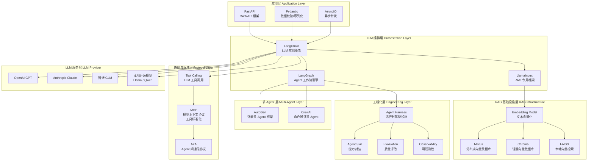

# 01 - Python AI 生态技术栈全景图

## Java 工程师对照

| Python AI 生态 | Java 生态类比 |
|---------------|-------------|
| FastAPI | Spring Boot |
| Pydantic | Bean Validation (JSR-303) |
| AsyncIO | CompletableFuture / Reactor |
| LangChain | Spring AI / 自定义编排层 |
| LangGraph | Spring StateMachine |
| Vector DB | Elasticsearch (向量检索) |
| MCP | JDBC / 标准化驱动接口 |
| Harness | JVM + Spring Runtime |
