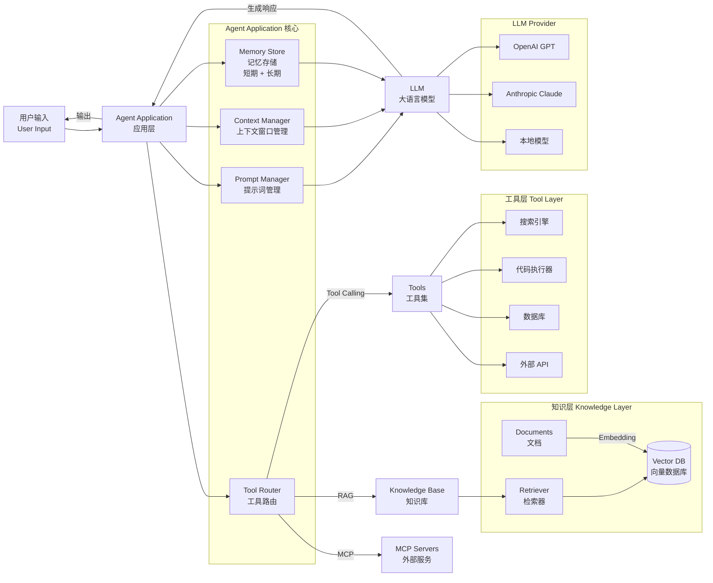

# 02 - LLM 应用架构全景图

## 核心概念说明

| 概念 | 英文 | 一句话解释 | Java 类比 |
|------|------|-----------|-----------|
| Prompt | 提示词 | 给 LLM 的输入指令 | 请求参数 |
| Token | 词元 | LLM 处理的最小单位 | 字符编码 |
| Context Window | 上下文窗口 | LLM 单次可处理的 Token 上限 | 缓冲区大小 |
| Embedding | 嵌入向量 | 文本的语义数学表示 | 对象序列化 |
| Retrieval | 检索 | 从知识库获取相关信息 | 数据库查询 |
| Tool Calling | 工具调用 | LLM 请求执行外部工具 | RPC 调用 |
| Memory | 记忆 | 跨轮对话的状态保持 | Session 管理 |
| Agent | 智能体 | LLM + 工具 + 推理循环 | 状态机 + 服务编排 |
