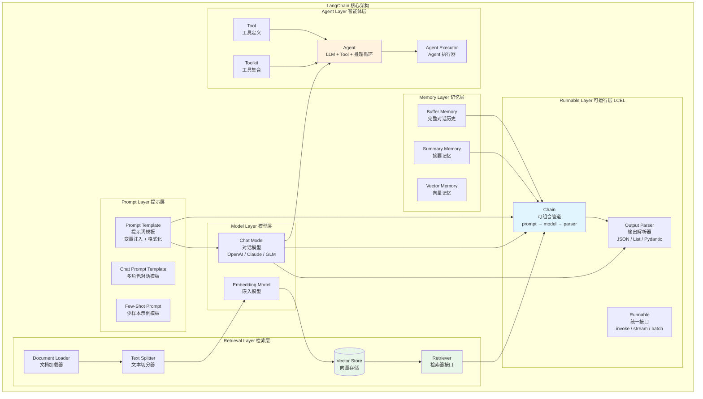

# 03 - LangChain 组件架构图



## LCEL 核心语法

```python
# LCEL (LangChain Expression Language) 声明式链式语法
# 类似 Java Stream API 的管道操作
chain = prompt | model | parser

# 等价于以下 Java 伪代码：
# String result = parser.parse(model.invoke(prompt.format(input)))
```

## 组件职责对照

| LangChain 组件 | 职责 | Java 类比 |
|---------------|------|-----------|
| Chat Model | LLM 调用封装 | HTTP Client |
| Prompt Template | 提示词管理 | 模板引擎 (Thymeleaf) |
| Runnable | 统一执行接口 | Functional Interface |
| Chain | 组件组合管道 | Stream Pipeline |
| Retriever | 知识检索 | Repository / DAO |
| Vector Store | 向量存储 | Elasticsearch Client |
| Memory | 对话状态 | HttpSession |
| Tool | 外部能力 | Service Method |
| Agent | 自主决策 | 状态机 + Service |
