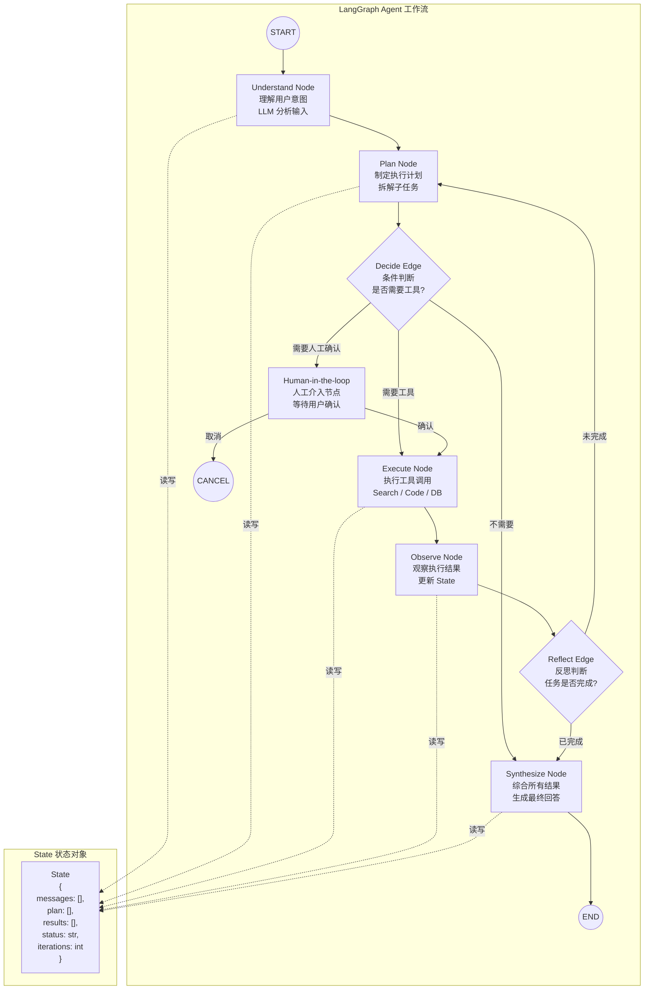

# 04 - LangGraph Agent 工作流图

## LangGraph vs LangChain Chain

| 特性 | LangChain Chain | LangGraph |
|------|----------------|-----------|
| 控制流 | 线性管道 | 图（有环 / 条件 / 并行） |
| 状态管理 | 无状态 / 外部注入 | 内置 State 管理 |
| 循环 | 不支持 | 支持（ReAct 循环） |
| 条件分支 | 不支持 | 条件 Edge |
| 人工介入 | 不支持 | 支持（interrupt） |
| 检查点 | 不支持 | 支持（Checkpointing） |
| Java 类比 | Stream Pipeline | Spring StateMachine |

## 核心概念

| 概念 | 说明 | Java 类比 |
|------|------|-----------|
| Graph | 工作流图，包含所有节点和边 | 状态机定义 |
| Node | 执行单元，接收 State 返回更新 | State Action |
| Edge | 控制流，固定或条件 | Transition |
| State | 在节点间共享的数据容器 | State Object |
| Checkpoint | 状态快照，支持恢复 | 持久化快照 |
| Interrupt | 中断执行等待外部输入 | 等待用户输入 |
