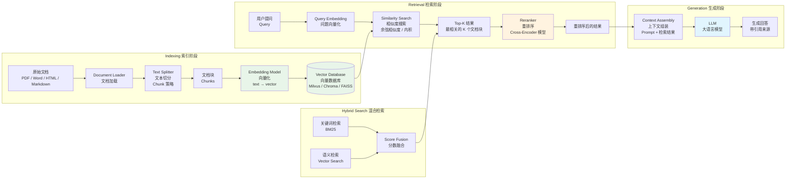

# 05 - RAG 管线架构图

## RAG 管线步骤说明

| 阶段 | 步骤 | 说明 | Java 类比 |
|------|------|------|-----------|
| Indexing | Document Loader | 加载各种格式文档 | 文件解析器 |
| Indexing | Text Splitter | 切分为合适大小的 Chunk | 分页处理 |
| Indexing | Embedding | 文本 → 向量表示 | 对象序列化 |
| Indexing | Vector DB | 存储向量 + 原文 | 索引写入 |
| Retrieval | Query Embedding | 问题 → 向量 | 查询编码 |
| Retrieval | Similarity Search | 向量相似度搜索 | ES 查询 |
| Retrieval | Rerank | 重排序优化 | 搜索结果排序 |
| Generation | Context Assembly | 组装 Prompt | 请求构建 |
| Generation | LLM | 生成最终回答 | 服务调用 |

## Chunk 策略对比

| 策略 | 说明 | 适用场景 |
|------|------|---------|
| Fixed Size | 固定字符数切分 | 通用场景 |
| Recursive | 递归按分隔符切分 | 代码 / 结构化文档 |
| Semantic | 按语义边界切分 | 长文 / 论文 |
| Parent-Child | 大块检索小块返回 | 高精度检索 |

## 向量数据库选型

| 数据库 | 特点 | 适用场景 | Java 类比 |
|--------|------|---------|-----------|
| Milvus | 分布式、高性能 | 生产环境大规模 | Elasticsearch Cluster |
| Chroma | 轻量、易用 | 原型 / 小规模 | H2 Database |
| FAISS | 本地、极快 | 研究实验 | Lucene 索引 |
| pgvector | PostgreSQL 扩展 | 已有 PG 环境 | PostgreSQL + 扩展 |
