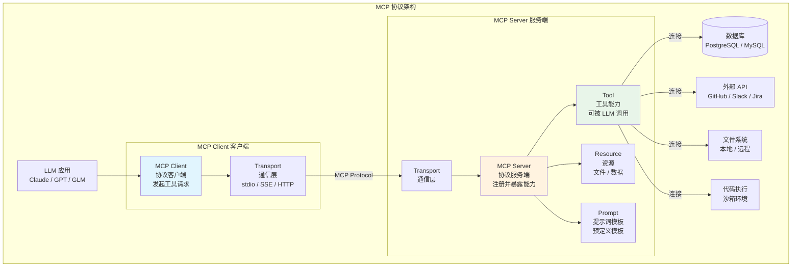
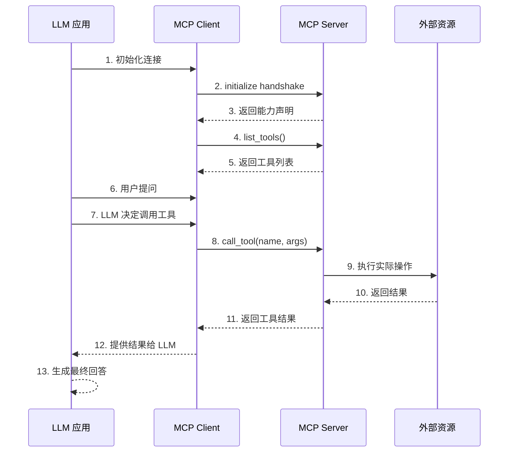

# 06 - MCP 协议架构图



## MCP 解决的核心问题

### Before MCP — 工具集成碎片化

```
LLM App A → 自定义 Tool 接口 → Tool 1, Tool 2, Tool 3
LLM App B → 另一套 Tool 接口 → Tool 1, Tool 2, Tool 3
LLM App C → 又一套 Tool 接口 → Tool 1, Tool 2, Tool 3
```

每个应用都需要重新集成工具，工具无法跨应用复用。

### After MCP — 标准化协议

```
LLM App A → MCP Client → MCP Server 1 (DB)
                       → MCP Server 2 (API)
                       → MCP Server 3 (File)
LLM App B → MCP Client → 同样的 MCP Servers
LLM App C → MCP Client → 同样的 MCP Servers
```

一次实现，处处可用。类似 JDBC 统一了数据库访问。

## MCP vs 传统 API 集成

| 特性 | 传统 API 集成 | MCP |
|------|-------------|-----|
| 接口定义 | 每个 API 自定义 | 标准化 Schema |
| 发现机制 | 手动文档 | 自动发现（list_tools） |
| 调用方式 | 各自实现 | 统一协议（call_tool） |
| 跨应用复用 | 不可复用 | 完全复用 |
| Java 类比 | 各数据库各自驱动 | JDBC 统一接口 |

## MCP 通信流程


