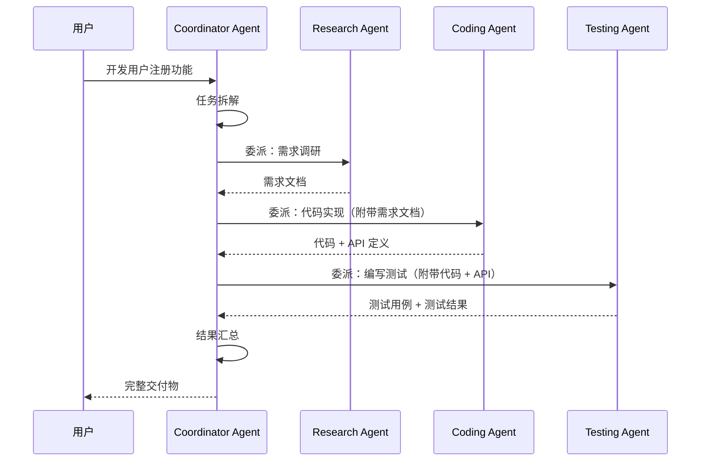

# 07 - A2A 多 Agent 协作图

```mermaid
graph TB
    User[用户请求<br/>"开发一个用户注册功能"] --> Coordinator

    subgraph "A2A 协作架构"
        Coordinator[Coordinator Agent<br/>协调 Agent<br/>任务拆解与分发]

        Coordinator -->|委派: 调研需求| Research
        Coordinator -->|委派: 编写代码| Coding
        Coordinator -->|委派: 编写测试| Testing
        Coordinator -->|委派: 代码审查| Review

        subgraph "Research Agent 调研"
            Research[Research Agent<br/>需求分析]
            Research --> ResearchTool[搜索工具]
            Research --> ResearchKB[知识库]
            Research -->|返回: 需求文档| Coordinator
        end

        subgraph "Coding Agent 编码"
            Coding[Coding Agent<br/>代码实现]
            Coding --> CodingTool[代码生成工具]
            Coding --> CodeExec[代码执行沙箱]
            Coding -->|返回: 代码实现| Coordinator
        end

        subgraph "Testing Agent 测试"
            Testing[Testing Agent<br/>测试编写]
            Testing --> TestTool[测试框架]
            Testing --> TestExec[测试执行]
            Testing -->|返回: 测试结果| Coordinator
        end

        subgraph "Review Agent 审查"
            Review[Review Agent<br/>代码审查]
            Review --> ReviewTool[审查规则]
            Review -->|返回: 审查意见| Coordinator
        end

        Coordinator -->|综合结果| Result[最终交付<br/>代码 + 测试 + 文档]
    end

    style Coordinator fill:#e1f5fe
    style Research fill:#e8f5e9
    style Coding fill:#fff3e0
    style Testing fill:#fce4ec
    style Review fill:#f3e5f5
```

## A2A 核心机制

| 机制 | 说明 | Java 类比 |
|------|------|-----------|
| Agent Communication | Agent 间消息传递 | 微服务间通信 (REST/gRPC) |
| Agent Discovery | 能力注册与发现 | 服务注册发现 (Eureka/Nacos) |
| Task Delegation | 任务委派与结果回收 | 任务分发 (消息队列) |
| Result Aggregation | 结果汇总整合 | 响应聚合 (API Gateway) |

## 协作模式

### 模式 1：中心化协调（Coordinator 模式）

```
Coordinator ←→ Agent A
            ←→ Agent B
            ←→ Agent C
```

一个协调 Agent 负责任务分发和结果汇总，其他 Agent 各司其职。

### 模式 2：去中心化协作（Peer-to-Peer 模式）

```
Agent A ←→ Agent B
         ←→ Agent C
Agent B ←→ Agent C
```

Agent 之间直接通信，通过共享状态或消息队列协调。

### 模式 3：流水线模式（Pipeline 模式）

```
Agent A → Agent B → Agent C → 输出
```

每个 Agent 处理特定阶段，按顺序流转。

## A2A 通信时序


