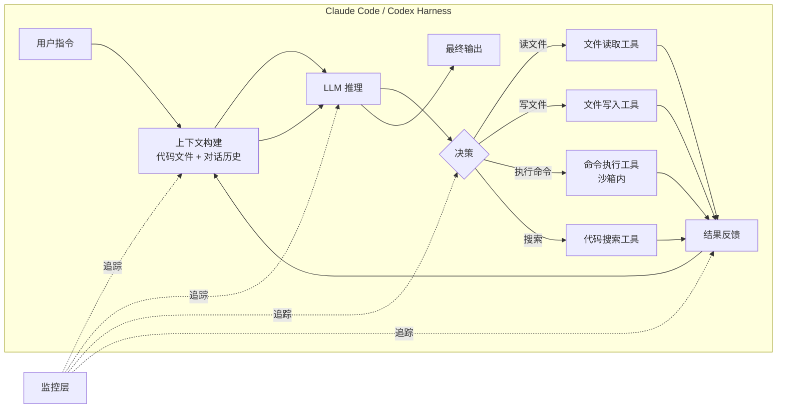

# 08 - Harness 工程基础设施架构图

```mermaid
graph TB
    subgraph "Agent Harness 工程基础设施"
        subgraph "上下文管理 Context Management"
            CtxManager[Context Manager<br/>上下文窗口管理]
            TokenCounter[Token Counter<br/>Token 计数]
            CtxCompressor[Context Compressor<br/>上下文压缩/摘要]
            CtxManager --> TokenCounter
            CtxManager --> CtxCompressor
        end

        subgraph "记忆系统 Memory System"
            ShortMemory[Short-term Memory<br/>短期记忆<br/>当前对话上下文]
            LongMemory[Long-term Memory<br/>长期记忆<br/>向量存储历史]
            EpisodicMemory[Episodic Memory<br/>情景记忆<br/>特定事件记录]
        end

        subgraph "工具运行时 Tool Runtime"
            ToolRegistry[Tool Registry<br/>工具注册中心]
            ToolSandbox[Tool Sandbox<br/>工具执行沙箱]
            ToolGuard[Tool Guard<br/>安全防护]
            ToolRegistry --> ToolSandbox
            ToolSandbox --> ToolGuard
        end

        subgraph "权限控制 Permission"
            AuthCheck[Auth Check<br/>权限校验]
            RateLimit[Rate Limiter<br/>频率限制]
            ApprovalFlow[Approval Flow<br/>人工审批流程]
        end

        subgraph "评估体系 Evaluation"
            Evaluator[Quality Evaluator<br/>质量评估器]
            RegressionTest[Regression Test<br/>回归测试]
            ABTest[A/B Testing<br/>对比测试]
        end

        subgraph "可观测性 Observability"
            Tracer[Tracer<br/>调用链追踪]
            Metrics[Metrics<br/>指标监控]
            Logger[Logger<br/>结构化日志]
            Dashboard[Dashboard<br/>可视化看板]
            Tracer --> Dashboard
            Metrics --> Dashboard
            Logger --> Dashboard
        end

        subgraph "反馈闭环 Feedback Loop"
            FeedbackCollector[Feedback Collector<br/>用户反馈收集]
            QualityAnalyzer[Quality Analyzer<br/>质量分析]
            AutoTuner[Auto Tuner<br/>自动调优]
            FeedbackCollector --> QualityAnalyzer
            QualityAnalyzer --> AutoTuner
        end
    end

    Agent[Agent Core<br/>Agent 核心] --> CtxManager
    Agent --> ShortMemory
    Agent --> LongMemory
    Agent --> ToolRegistry
    Agent --> AuthCheck
    Agent --> Evaluator
    Agent --> Tracer
    Agent --> FeedbackCollector

    style Agent fill:#e1f5fe,stroke:#0288d1,stroke-width:3px
    style CtxManager fill:#e8f5e9
    style ToolSandbox fill:#fff3e0
    style Evaluator fill:#fce4ec
    style Dashboard fill:#f3e5f5
```

## Harness 是什么？

**定义**：Agent Harness 是让 Agent 稳定、可靠、可观测运行的工程基础设施层。

**类比**：
- JVM 之于 Java 应用 → Harness 之于 AI Agent
- Kubernetes 之于微服务 → Harness 之于 Agent
- Spring Runtime 之于 Spring 应用 → Harness 之于 Agent

## 为什么需要 Harness？

| 问题 | LLM 特性 | Harness 解决方案 |
|------|---------|-----------------|
| 上下文溢出 | Context Window 有限 | 上下文压缩 + 摘要 |
| 幻觉 | LLM 可能编造信息 | 评估 + 事实校验 |
| 工具安全 | LLM 可能调用危险操作 | 沙箱 + 权限 + 审批 |
| 成本失控 | Token 消耗不确定 | 监控 + 频率限制 |
| 质量不稳定 | 输出质量波动 | 评估 + 回归测试 |
| 不可调试 | 黑盒决策 | 追踪 + 日志 + 看板 |

## Coding Agent Harness 示例

