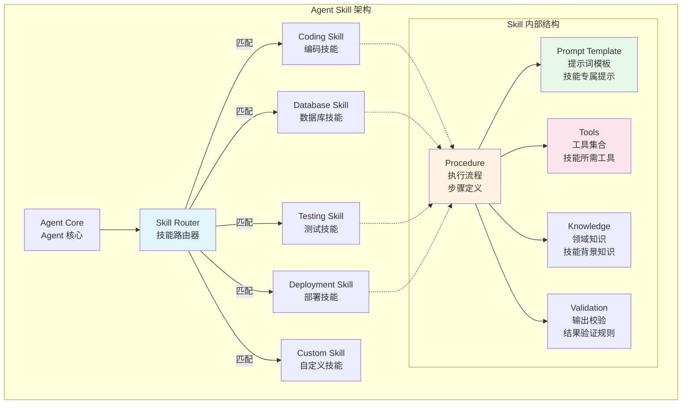
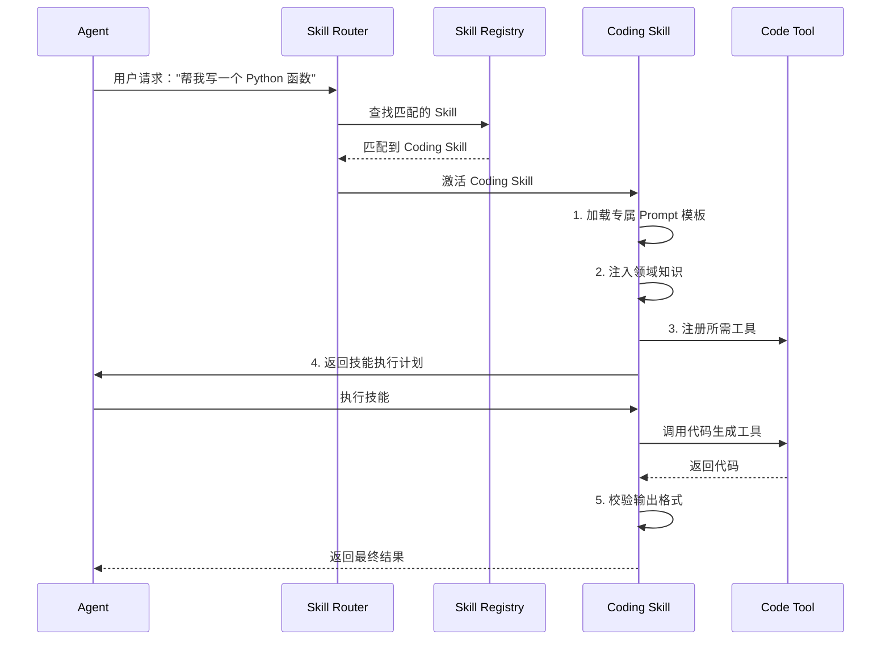

# 09 - Skill 架构图

## Skill vs Tool vs Prompt

| 维度 | Prompt | Tool | Skill |
|------|--------|------|-------|
| 本质 | 文本指令 | 函数/方法 | 完整能力封装 |
| 粒度 | 单次交互 | 单个操作 | 完整工作流 |
| 组成 | 纯文本 | 函数定义 | Procedure + Prompt + Tool + Knowledge |
| 复杂度 | 低 | 中 | 高 |
| 复用性 | 低 | 中 | 高 |
| 可分享 | 文本复制 | 代码复制 | 包/模块分发 |
| Java 类比 | 配置参数 | Service 方法 | Spring Bean (含依赖和方法) |

## Skill 注册与调用流程

## Skill 设计原则

1. **单一职责**：每个 Skill 聚焦一个领域
2. **自包含**：包含所需 Prompt、Tool、Knowledge
3. **可组合**：Skill 之间可以协作
4. **可复用**：跨 Agent 跨项目复用
5. **可测试**：有明确的输入输出验证规则
