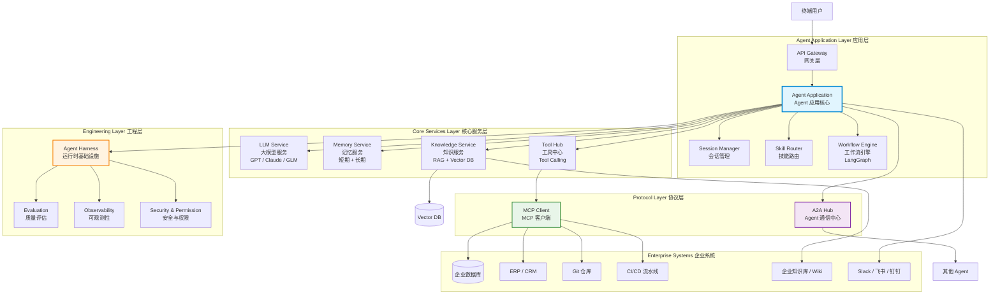

# 10 - 企业级 Agent 架构图

## 各层职责说明

| 层级 | 组件 | 职责 | Java 类比 |
|------|------|------|-----------|
| 应用层 | Agent Application | 接收用户请求、路由分发、工作流编排 | Spring Boot Application |
| 核心服务层 | LLM Service | 大模型调用 | 外部服务客户端 |
| 核心服务层 | Memory Service | 对话记忆管理 | Redis / Session Store |
| 核心服务层 | Knowledge Service | 知识检索（RAG） | Elasticsearch Service |
| 核心服务层 | Tool Hub | 工具注册与调用 | Service Registry |
| 协议层 | MCP Client | 标准化工具调用 | JDBC Client |
| 协议层 | A2A Hub | Agent 间通信 | 消息总线 / RPC |
| 工程层 | Harness | 运行时基础设施 | Spring Runtime + JVM |
| 工程层 | Evaluation | 质量评估 | 测试框架 |
| 工程层 | Observability | 监控追踪 | SkyWalking / Zipkin |
| 工程层 | Security | 权限控制 | Spring Security |

## 关键设计决策

### 1. 模型选型
- 通用对话：GPT-4o / Claude 3.5
- 代码生成：Claude 3.5 Sonnet
- 中文场景：GLM-4 / Qwen
- 成本敏感：开源模型 + 本地部署

### 2. 上下文策略
- 短对话：全量保留
- 长对话：摘要压缩 + 向量检索
- 关键信息：写入长期记忆

### 3. 工具治理
- 注册制：工具必须注册才能调用
- 权限分级：只读 / 读写 / 危险操作
- 审计日志：所有工具调用记录

### 4. 安全合规
- 输入过滤：Prompt Injection 防护
- 输出审查：敏感信息过滤
- 数据隔离：租户间数据隔离
