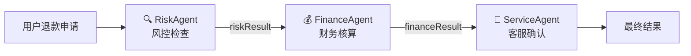
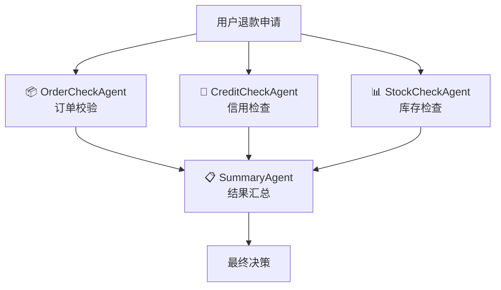
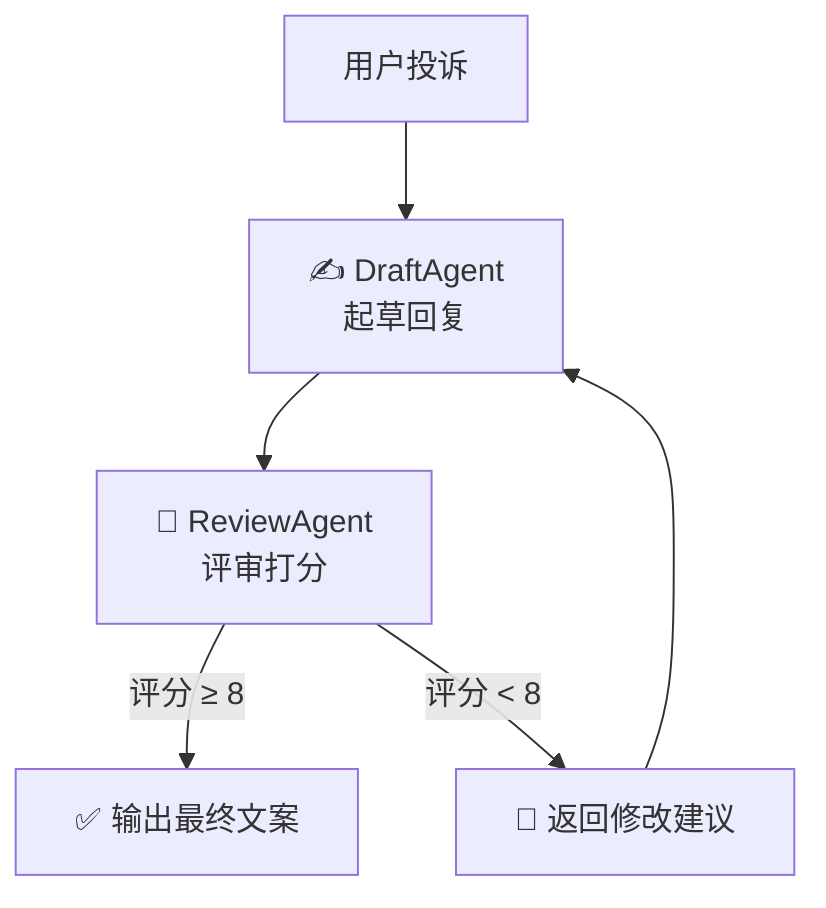
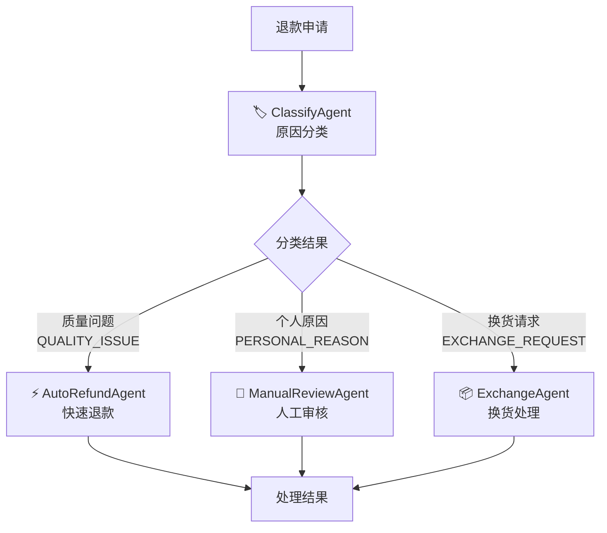
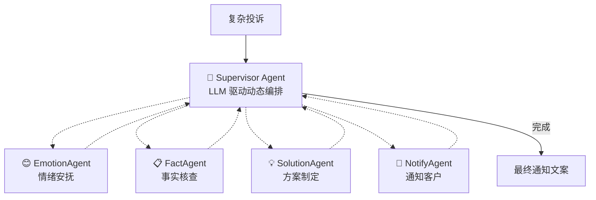
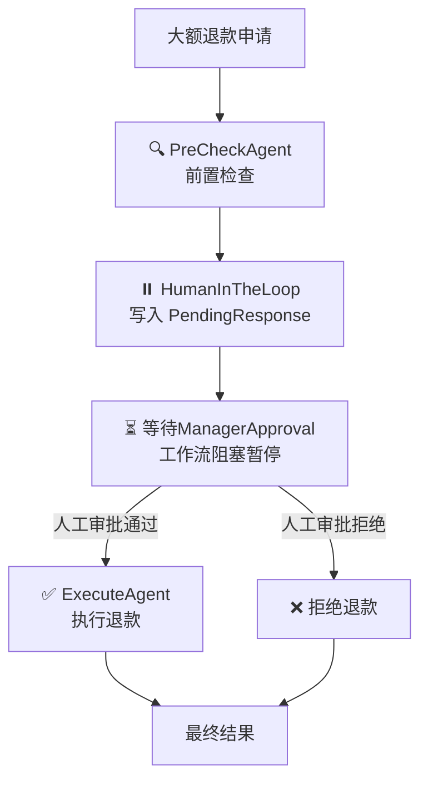

# LangChain4j Agentic Workflow Demo

> 🛒 **电商智能售后处理平台** — 使用 LangChain4j Agentic API 实现六种 AI 工作流模式


---

## 📖 项目概述

本项目以**电商售后场景**为统一业务背景，使用 **LangChain4j 1.16.0-beta26 Agentic API** 演示六种 AI Agent 工作流编排模式。所有模式共享同一套领域模型和模拟数据，通过 REST API 暴露，可直接交互测试。

**LLM 提供方：** Agnes AI (OpenAI 兼容格式)

---

## 🏗️ 架构总览

```mermaid
graph TD
    subgraph "接入层"
        CLI[Web Dashboard<br/>index.html]
        REST[REST API<br/>8 个端点]
    end

    subgraph "工作流层"
        SEQ[1. Sequential<br/>顺序审批链]
        PAR[2. Parallel<br/>并行核验]
        LOOP[3. Loop<br/>迭代优化]
        COND[4. Conditional<br/>条件分流]
        SUP[5. Supervisor<br/>主管调度]
        HITL[6. HumanInTheLoop<br/>人工介入]
    end

    subgraph "Agent 层"
        AGENTS[17 个 Agent 接口<br/>@Agent 注解 + LLM 驱动]
    end

    subgraph "基础设施层"
        TOOLS[AfterSalesTools<br/>@Tool 工具]
        DATA[MockDataService<br/>模拟数据]
        LLM[Agnes AI<br/>agnes-2.0-flash]
    end

    CLI --> REST
    REST --> SEQ & PAR & LOOP & COND & SUP & HITL
    SEQ & PAR & LOOP & COND & SUP & HITL --> AGENTS
    AGENTS --> TOOLS & DATA & LLM
```

---

## 🚀 快速开始

### 环境要求

- **JDK 17** 或更高版本
- **Maven 3.6** 或更高版本
- 网络可访问 `https://apihub.agnes-ai.com`

### 启动应用

```bash
cd langchain4j-agentic
mvn spring-boot:run
```

应用启动后访问：
- **Web Dashboard:** http://localhost:8080
- **健康检查:** http://localhost:8080/api/health

---

## 🎯 六种工作流模式

### 1. Sequential — 顺序审批链

**业务场景：** 用户申请退款，依次经过风控、财务、客服三级审批，每步依赖前一步输出。



| Agent | 职责 | 输入 | 输出 |
|-------|------|------|------|
| RiskAgent | 识别欺诈/高频退款 | orderId, reason | RiskResult (riskScore, riskTag) |
| FinanceAgent | 计算退款金额 | orderId, RiskResult | FinanceResult (refundAmount) |
| ServiceAgent | 综合评估生成结果 | orderId, RiskResult, FinanceResult | FinalResult (approved, notifyText) |

**API：**
```
POST /api/sequential/refund?orderId=ORD-001&reason=商品质量问题
```

**测试场景：**
- `ORD-001` + "商品质量问题" → 低风险 → 全额退款通过
- `ORD-003` + "不喜欢了" → 高风险 → 扣手续费/拒绝

---

### 2. Parallel — 并行核验

**业务场景：** 退款申请同时核验订单、信用、库存三个维度，互不依赖，并行处理后汇总。



| Agent | 职责 |
|-------|------|
| OrderCheckAgent | 核实订单状态、签收情况 |
| CreditCheckAgent | 评估用户信用等级、退款历史 |
| StockCheckAgent | 检查商品库存状况 |
| SummaryAgent | 汇总三方结果，做出最终决策 |

**API：**
```
POST /api/parallel/check?orderId=ORD-001&reason=商品质量问题
```

---

### 3. Loop — 迭代优化

**业务场景：** 自动生成售后回复文案，通过"起草→评审→修改"循环迭代，直到评分达标（≥8分）。



| Agent | 职责 |
|-------|------|
| DraftAgent | 根据投诉内容和评审反馈起草/修改回复文案 |
| ReviewAgent | 评审文案质量，输出 APPROVED（≥8分）或改进建议 |

**API：**
```
POST /api/loop/reply?orderId=ORD-001&reason=商品质量问题
```

---

### 4. Conditional — 条件分流

**业务场景：** 根据退款原因自动分类，走不同的处理通道（快速退款/人工审核/换货处理）。



| Agent | 职责 |
|-------|------|
| ClassifyAgent | 分析退款原因，输出分类标签 |
| AutoRefundAgent | 质量问题 → 快速退款通道 |
| ManualReviewAgent | 个人原因 → 人工审核通道 |
| ExchangeAgent | 换货请求 → 换货处理通道 |

**API：**
```
POST /api/conditional/refund?orderId=ORD-001&reason=商品质量问题      → 快速退款
POST /api/conditional/refund?orderId=ORD-002&reason=不喜欢这个颜色    → 人工审核
```

---

### 5. Supervisor — 主管调度

**业务场景：** 复杂售后诉求（投诉+赔偿+情绪激烈），由 Supervisor Agent 动态编排子 Agent 执行计划。



| Agent | 职责 |
|-------|------|
| Supervisor | LLM 驱动的调度中心，自主决定调用顺序和时机 |
| EmotionAgent | 安抚客户情绪，分析投诉严重程度 |
| FactAgent | 核查订单事实、历史记录 |
| SolutionAgent | 制定赔偿/解决方案 |
| NotifyAgent | 生成客户通知文案 |

**关键设计：** Supervisor 自主决定调用顺序，不固定流程；`maxAgentsInvocations(8)` 限制最大调用次数。

**API：**
```
POST /api/supervisor/handle?orderId=ORD-001&complaint=收到商品有质量问题，非常生气，要求退款并赔偿
```

---

### 6. HumanInTheLoop — 人工介入

**业务场景：** 大额退款需人工审批，Agent 完成前置检查后自动暂停，等待主管审批后恢复执行。



| 步骤 | 说明 |
|------|------|
| 提交退款 | `POST /api/humanintheloop/refund` → 返回 requestId + 前置检查材料，状态 PENDING_APPROVAL |
| 人工审批 | `POST /api/humanintheloop/approve?requestId=REQ-xxx&decision=APPROVED` → 注入审批结果，工作流恢复 |
| 获取结果 | 审批接口直接返回最终执行结果 |

**API（两步交互）：**
```
# 步骤1：提交
POST /api/humanintheloop/refund?orderId=ORD-003&reason=不喜欢了&amount=918
# 步骤2：审批
POST /api/humanintheloop/approve?requestId=REQ-xxxx&decision=APPROVED&comment=同意退款
```

---

## 📡 API 总览

| 方法 | 端点 | 模式 | 参数 |
|------|------|------|------|
| `GET` | `/api/health` | 健康检查 | — |
| `POST` | `/api/sequential/refund` | Sequential | `orderId`, `reason` |
| `POST` | `/api/parallel/check` | Parallel | `orderId`, `reason` |
| `POST` | `/api/loop/reply` | Loop | `orderId`, `reason` |
| `POST` | `/api/conditional/refund` | Conditional | `orderId`, `reason` |
| `POST` | `/api/supervisor/handle` | Supervisor | `orderId`, `complaint` |
| `POST` | `/api/humanintheloop/refund` | HumanInTheLoop | `orderId`, `reason`, `amount` |
| `POST` | `/api/humanintheloop/approve` | HumanInTheLoop | `requestId`, `decision`, `comment`(可选) |

---

## 📁 项目结构

```
langchain4j-agentic/
├── pom.xml                                 # Maven 配置
├── PLAN.md                                 # 规划文档
├── README.md                               # 本文档
└── src/
    ├── main/java/com/example/agentic/
    │   ├── AgenticDemoApplication.java     # Spring Boot 入口
    │   ├── controller/HealthController.java
    │   ├── common/
    │   │   ├── model/                      # Order, Product, User, RefundRequest 等
    │   │   ├── service/MockDataService.java # 模拟数据
    │   │   └── tool/AfterSalesTools.java   # @Tool 工具类
    │   ├── sequential/                     # 一期：顺序审批链
    │   │   ├── RefundWorkflow.java
    │   │   ├── agent/ (RiskAgent, FinanceAgent, ServiceAgent)
    │   │   ├── service/SequentialService.java
    │   │   └── controller/SequentialController.java
    │   ├── parallel/                       # 二期：并行核验
    │   ├── loop/                           # 二期：迭代优化
    │   ├── conditional/                    # 三期：条件分流
    │   ├── supervisor/                     # 三期：主管调度
    │   └── humanintheloop/                 # 四期：人工介入
    └── main/resources/
        ├── application.yml                 # 应用配置
        └── static/index.html               # Web Dashboard
```

---

## 🧪 测试数据

| 订单ID | 用户 | 商品 | 金额 | 状态 | 特点 |
|--------|------|------|------|------|------|
| `ORD-001` | 张三 (VIP) | 蓝牙耳机 | ¥299 | 已签收 | 信用良好，低风险 |
| `ORD-002` | 李四 (VIP) | 机械键盘 | ¥599 | 运输中 | 消费稳定 |
| `ORD-003` | 王五 (普通) | 运动跑鞋 x2 | ¥918 | 已支付 | 高频退款(4次)，高风险 |

---

## 🛠️ 技术栈

| 技术 | 版本 | 说明 |
|------|------|------|
| Java | 17 | 运行环境 |
| Spring Boot | 3.5.3 | 应用框架 |
| LangChain4j | 1.16.0-beta26 | AI Agent 框架 |
| Agnes AI | agnes-2.0-flash | LLM 提供方 |
| Lombok | 1.18.36 | 代码简化 |
| Maven | 3.6+ | 构建工具 |

---

## 📊 交付节奏

| 阶段 | 内容 | 状态 |
|------|------|------|
| 一期 | 项目骨架 + Sequential | ✅ 完成 |
| 二期 | Parallel + Loop | ✅ 完成 |
| 三期 | Conditional + Supervisor | ✅ 完成 |
| 四期 | HumanInTheLoop | ✅ 完成 |
| 五期 | README + 流程图 + 综合入口 | ✅ 完成 |
