# LangChain4j Agent 编排实战教程

> 面向 Java 程序员的 AI Agent 工作流编排入门指南
>
> 基于 LangChain4j 1.16 Agentic API，以电商智能售后场景为案例

---

## 目录

1. [什么是 Agent 编排](#1-什么是-agent-编排)
2. [核心概念速览](#2-核心概念速览)
3. [环境与项目搭建](#3-环境与项目搭建)
4. [模式一：Sequential — 顺序串联](#4-模式一sequential--顺序串联)
5. [模式二：Parallel — 并行分发](#5-模式二parallel--并行分发)
6. [模式三：Loop — 迭代优化](#6-模式三loop--迭代优化)
7. [模式四：Conditional — 条件分流](#7-模式四conditional--条件分流)
8. [模式五：Supervisor — 主管调度](#8-模式五supervisor--主管调度)
9. [模式六：HumanInTheLoop — 人工介入](#9-模式六humanintheloop--人工介入)
10. [模式对比与选型指南](#10-模式对比与选型指南)
11. [最佳实践与踩坑经验](#11-最佳实践与踩坑经验)

---

## 1. 什么是 Agent 编排

### 1.1 从单个 LLM 调用到多 Agent 协作

传统的 LLM 调用模式是"一问一答"：

```
用户输入 → LLM 推理 → 输出结果
```

但在真实业务场景中，复杂任务往往需要**多个步骤**、**多个决策点**、**工具调用**、**并行处理**甚至是**人工审批节点**。这就是 Agent 编排要解决的问题。

Agent 编排（Agentic Workflow）是指：**将多个 AI Agent 按照特定的拓扑结构组织起来，让它们像流水线一样协作处理复杂任务**。

### 1.2 一个直观的类比

想象一个电商售后团队：

| 传统单 LLM 模式 | Agent 编排模式 |
|---|---|
| 一个通才包办所有事情 | 风控专员 → 财务专员 → 客服主管（各司其职） |
| 出错时全部重来 | 单独某步可以重试/修正 |
| 不能并行 | 可以同时核验订单、信用、库存 |
| 无法插入人工审核 | 可以在任意节点暂停等人工决策 |

### 1.3 本项目中的六种编排模式

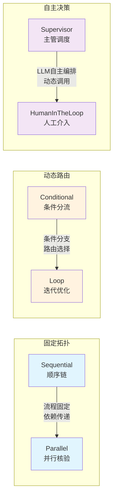

---

## 2. 核心概念速览

在深入代码之前，先了解 LangChain4j Agentic API 的几个关键概念：

### 2.1 Agent（智能体）

Agent 是一个**由 LLM 驱动的、能调用工具完成特定任务的代理**。它用 Java 接口声明，`@Agent` 注解标识：

```java
public interface RiskAgent {
    @Agent(name = "RiskAgent",
            description = "风控检查Agent",
            outputKey = "riskResult")
    String assessRisk(@V("orderId") String orderId, @V("reason") String reason);
}
```

关键元素：
- **`@Agent`**：声明这是一个 Agent，指定名称、描述和输出键
- **`@UserMessage`**：Agent 的系统提示词（Prompt），定义角色和任务
- **`@V("xxx")`**：从 AgenticScope 中读取/绑定变量
- **`outputKey`**：执行结果写入 AgenticScope 的键名

### 2.2 AgenticScope（共享上下文）

AgenticScope 是整个工作流的**共享内存**。Agent 之间不直接传参，而是通过 Scope 读写数据：

```
Agent A 执行 → 写入 Scope["riskResult"] = "..."
Agent B 执行 → 通过 @V("riskResult") 读取
```

这类似于编程中的"全局变量"或 Map，但它是类型安全且工作流级别的。

### 2.3 Tool（工具）

Tool 是 Agent 的"手脚"——让 LLM 能够查询数据库、调用 API、操作业务系统。用 `@Tool` 注解暴露给 Agent：

```java
@Tool("查询订单信息")
public String queryOrder(@P("订单ID") String orderId) { ... }

@Tool("查询用户信息")
public String queryUser(@P("用户ID") String userId) { ... }
```

Agent 会根据 Prompt 中的指引，自动决定何时调用哪个 Tool。

### 2.4 Builder 体系

LangChain4j Agentic 提供了五种 Builder，对应不同的编排模式：

| Builder | 作用 | 关键方法 |
|----------|------|----------|
| `agentBuilder()` | 构建单个 Agent | `.tools()`, `.outputKey()` |
| `sequenceBuilder()` | 顺序串联 Agent | `.subAgents(a, b, c)` |
| `parallelBuilder()` | 并行分发 Agent | `.subAgents(a, b, c)` |
| `conditionalBuilder()` | 条件路由（if/else） | `.subAgents(predicate, agent)` |
| `loopBuilder()` | 循环迭代 | `.exitCondition()`, `.maxIterations()` |
| `supervisorBuilder()` | LLM 驱动动态调度 | `.supervisorContext()` |
| `humanInTheLoopBuilder()` | 暂停等人工 | `.responseProvider()` |

### 2.5 技术栈一览

| 组件 | 版本 | 说明 |
|------|------|------|
| Java | 17 | 运行环境 |
| Spring Boot | 3.5.3 | 应用框架 |
| LangChain4j | 1.16.0-beta26 | Agentic API |
| LLM | agnes-2.0-flash | 兼容 OpenAI 格式 |
| 构建 | Maven | 依赖管理 |

---

## 3. 环境与项目搭建

### 3.1 Maven 依赖

核心依赖只有三个：

```xml
<!-- Agentic API（工作流编排核心） -->
<dependency>
    <groupId>dev.langchain4j</groupId>
    <artifactId>langchain4j-agentic</artifactId>
    <version>1.16.0-beta26</version>
</dependency>

<!-- Spring Boot Starter（自动装配 ChatModel、OpenAI 等） -->
<dependency>
    <groupId>dev.langchain4j</groupId>
    <artifactId>langchain4j-spring-boot-starter</artifactId>
    <version>1.16.0-beta26</version>
</dependency>

<!-- OpenAI 兼容适配 -->
<dependency>
    <groupId>dev.langchain4j</groupId>
    <artifactId>langchain4j-open-ai-spring-boot-starter</artifactId>
    <version>1.16.0-beta26</version>
</dependency>
```

### 3.2 应用配置

```yaml
langchain4j:
  open-ai:
    chat-model:
      api-key: sk-xxx
      base-url: https://your-llm-endpoint/v1   # 支持任何 OpenAI 兼容服务
      model-name: your-model-name
      temperature: 0.7
```

### 3.3 项目结构

```text
src/main/java/com/example/agentic/
├── common/
│   ├── model/          # Order, Product, User 等数据模型
│   ├── service/        # MockDataService（模拟数据）
│   └── tool/           # AfterSalesTools（@Tool 工具类）
├── sequential/         # 模式一：顺序审批链
│   ├── RefundWorkflow.java
│   ├── agent/          # RiskAgent, FinanceAgent, ServiceAgent
│   ├── service/        # SequentialService
│   └── controller/     # SequentialController
├── parallel/           # 模式二：并行核验
├── loop/               # 模式三：迭代优化
├── conditional/        # 模式四：条件分流
├── supervisor/         # 模式五：主管调度
├── humanintheloop/     # 模式六：人工介入
└── AgenticDemoApplication.java
```

---

## 4. 模式一：Sequential — 顺序串联

### 4.1 场景描述

> **业务需求：** 用户申请退款，依次经过风控、财务、客服三级审批，每步依赖前一步输出。

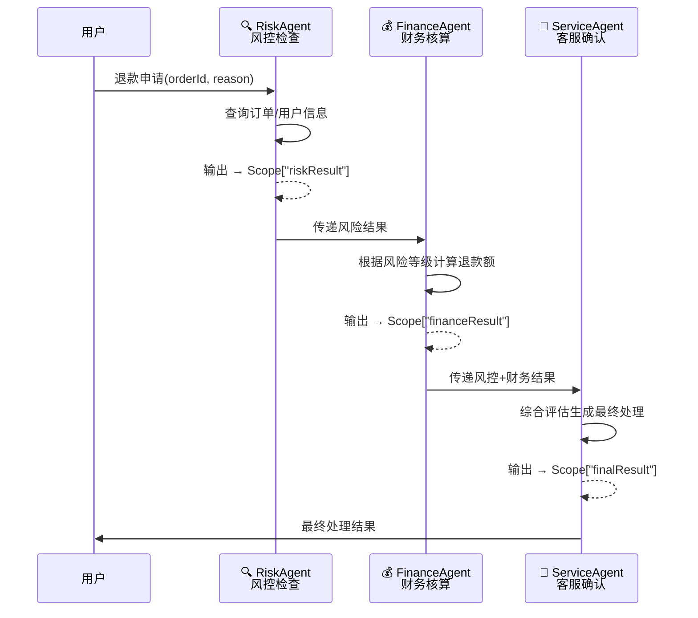

### 4.2 关键特征

- **有向无环图（DAG）**：Agent A → Agent B → Agent C
- **数据依赖**：后续 Agent 依赖前面 Agent 的 outputKey
- **适用场景**：审批流、数据处理管道、分层推理

### 4.3 代码实现

#### Step 1：定义 Agent 接口

每个 Agent 是一个接口，核心是 `@UserMessage` 中的 Prompt 和 `@V` 参数绑定：

```java
// RiskAgent.java — 风控检查
public interface RiskAgent {
    @UserMessage("""
        你是电商售后风控专员。
        请根据以下退款申请信息进行风控评估。
        
        订单ID: {{orderId}}
        退款原因: {{reason}}
        
        请先调用工具查询订单和用户信息，然后评估风险等级：
        - 高风险(HIGH)：历史退款≥3次、金额>500且原因为个人
        - 中风险(MEDIUM)：退款1-2次、已签收且原因为个人
        - 低风险(LOW)：首次退款、质量问题、VIP用户
        
        返回格式：
        风险等级: [HIGH/MEDIUM/LOW]
        风险评分: [0-100]
        风险标签: [欺诈嫌疑/高频退款/正常退款/质量问题]
        """)
    @Agent(name = "RiskAgent",
            description = "风控检查Agent",
            outputKey = "riskResult")
    String assessRisk(@V("orderId") String orderId, @V("reason") String reason);
}
```

```java
// FinanceAgent.java — 财务核算
public interface FinanceAgent {
    @UserMessage("""
        你是电商售后财务专员。请根据风控评估结果核算退款金额。
        
        订单ID: {{orderId}}
        风控结果: {{riskResult}}
        
        核算规则：
        - 风控LOW：全额退款
        - 风控MEDIUM：退款80%，扣20%手续费
        - 风控HIGH：退款50%，扣50%违约金
        
        返回格式：
        订单金额: [原金额]
        退款金额: [实际退款]
        扣除金额: [扣除金额]
        """)
    @Agent(name = "FinanceAgent",
            description = "财务核算Agent，根据风控结果计算退款金额",
            outputKey = "financeResult")
    String calculateRefund(
        @V("orderId") String orderId, 
        @V("riskResult") String riskResult    // ← 从前一步读取
    );
}
```

```java
// ServiceAgent.java — 客服确认
public interface ServiceAgent {
    @UserMessage("""
        你是电商售后客服主管。综合风控和财务结果做出最终决定。
        
        订单ID: {{orderId}}
        退款原因: {{reason}}
        风控结果: {{riskResult}}
        财务核算结果: {{financeResult}}
        
        决定规则：
        - 风控LOW且财务全额退款 → 批准
        - 风控MEDIUM → 部分退款+补偿优惠券
        - 风控HIGH → 拒绝但保留申诉通道
        
        返回格式：
        处理结果: [APPROVED/PARTIAL_REFUND/REJECTED]
        最终退款金额: [金额]
        用户通知: [发送给客户的文案]
        """)
    @Agent(name = "ServiceAgent", outputKey = "finalResult")
    String finalizeResult(
        @V("orderId") String orderId,
        @V("reason") String reason,
        @V("riskResult") String riskResult,     // ← 读取前两步
        @V("financeResult") String financeResult  // ← 读取前两步
    );
}
```

#### Step 2：定义工作流接口

```java
// RefundWorkflow.java
public interface RefundWorkflow {
    @Agent
    String processRefund(
        @V("orderId") String orderId, 
        @V("reason") String reason
    );
}
```

#### Step 3：组装工作流

```java
@Service
public class SequentialService {
    private final RefundWorkflow refundWorkflow;

    public SequentialService(ChatModel chatModel, AfterSalesTools tools) {
        // 1. 构建三个子 Agent
        RiskAgent riskAgent = AgenticServices
            .agentBuilder(RiskAgent.class)
            .chatModel(chatModel)
            .tools(tools)          // ← 注入工具，让 Agent 能查询数据
            .outputKey("riskResult")
            .build();

        FinanceAgent financeAgent = AgenticServices
            .agentBuilder(FinanceAgent.class)
            .chatModel(chatModel)
            .tools(tools)
            .outputKey("financeResult")
            .build();

        ServiceAgent serviceAgent = AgenticServices
            .agentBuilder(ServiceAgent.class)
            .chatModel(chatModel)
            .tools(tools)
            .outputKey("finalResult")
            .build();

        // 2. 用 sequenceBuilder 串联
        this.refundWorkflow = AgenticServices
            .sequenceBuilder(RefundWorkflow.class)
            .subAgents(riskAgent, financeAgent, serviceAgent)  // ← 按顺序执行
            .outputKey("finalResult")
            .build();
    }

    public String processRefund(String orderId, String reason) {
        return refundWorkflow.processRefund(orderId, reason);
    }
}
```

### 4.4 数据流动图

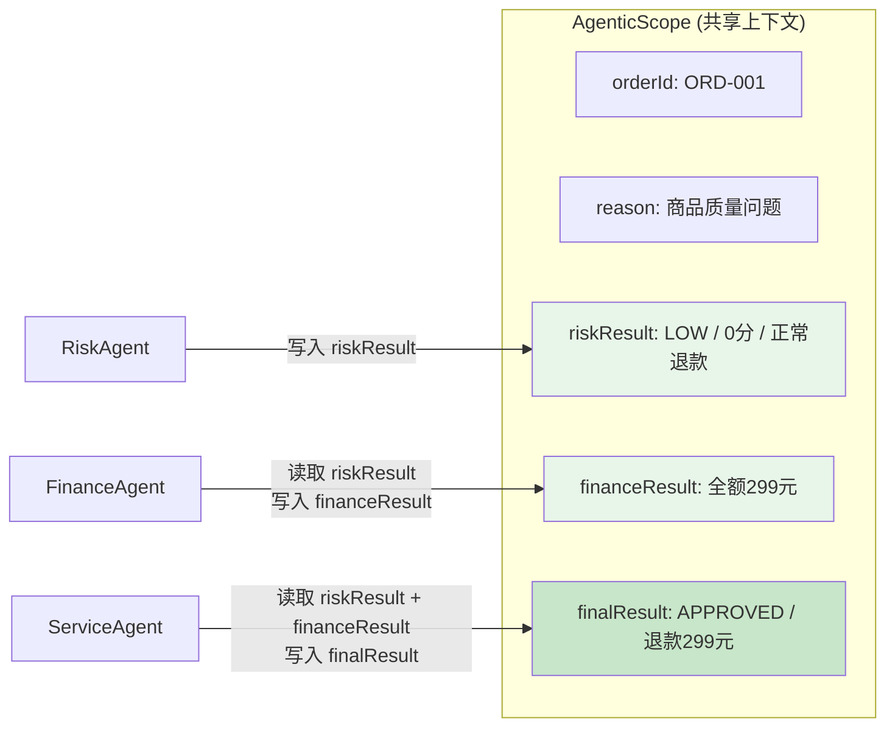

### 4.5 调用示例

```bash
# 低风险场景：VIP用户 + 质量问题
curl -X POST "http://localhost:8081/api/sequential/refund?orderId=ORD-001&reason=商品质量问题"

# 高风险场景：普通用户 + 频繁退款
curl -X POST "http://localhost:8081/api/sequential/refund?orderId=ORD-003&reason=不喜欢了"
```

---

## 5. 模式二：Parallel — 并行分发

### 5.1 场景描述

> **业务需求：** 退款申请同时核验订单、信用、库存三个维度，互不依赖，并行处理后汇总。

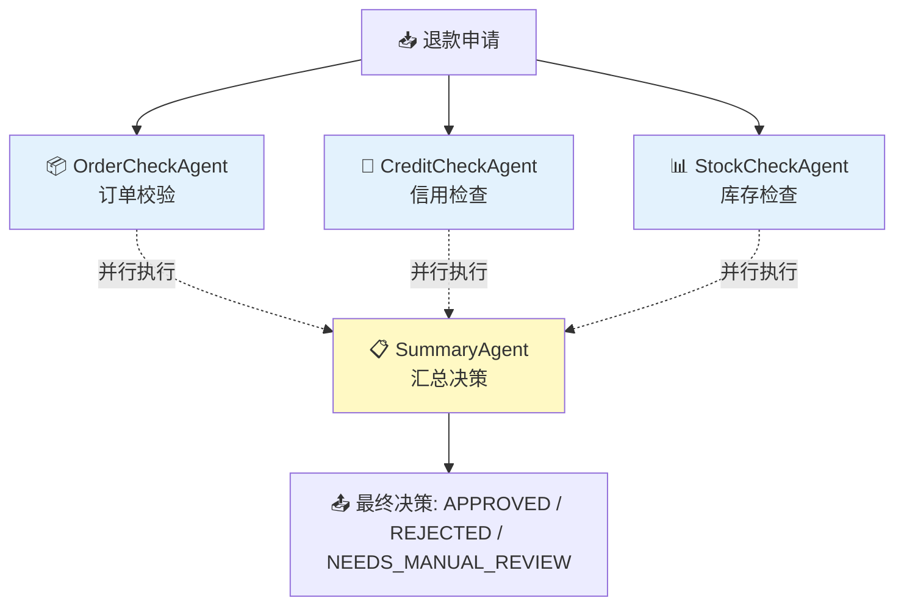

### 5.2 关键特征

- **无数据依赖**：三个检查 Agent 互不依赖，可同时执行
- **缩短延时**：总耗时 ≈ max(各 Agent 耗时)，而非累加
- **汇总收敛**：需要一个汇总 Agent 将所有结果收敛为最终决策

### 5.3 代码实现

核心技巧：**Parallel block + Sequential 串联**

```java
@Service
public class ParallelService {
    private final ParallelCheckWorkflow parallelCheckWorkflow;

    public ParallelService(ChatModel chatModel, AfterSalesTools tools) {
        // 1. 构建三个并行 Agent
        OrderCheckAgent orderCheck = AgenticServices
            .agentBuilder(OrderCheckAgent.class).chatModel(chatModel)
            .tools(tools).outputKey("orderCheckResult").build();

        CreditCheckAgent creditCheck = AgenticServices
            .agentBuilder(CreditCheckAgent.class).chatModel(chatModel)
            .tools(tools).outputKey("creditCheckResult").build();

        StockCheckAgent stockCheck = AgenticServices
            .agentBuilder(StockCheckAgent.class).chatModel(chatModel)
            .tools(tools).outputKey("stockCheckResult").build();

        // 2. 构建并行块 —— 三个 Agent 同时执行
        UntypedAgent parallelBlock = AgenticServices
            .parallelBuilder()
            .subAgents(orderCheck, creditCheck, stockCheck)
            .outputKey("parallelCheckResult")
            .build();
        // ⚠️ 注意：parallelBuilder 返回 UntypedAgent，不是类型化接口

        // 3. 构建汇总 Agent
        SummaryAgent summary = AgenticServices
            .agentBuilder(SummaryAgent.class).chatModel(chatModel)
            .outputKey("summaryResult").build();

        // 4. 串联：并行块 → 汇总
        this.parallelCheckWorkflow = AgenticServices
            .sequenceBuilder(ParallelCheckWorkflow.class)
            .subAgents(parallelBlock, summary)   // ← 先并行、后汇总
            .outputKey("summaryResult")
            .build();
    }
}
```

### 5.4 数据流动图

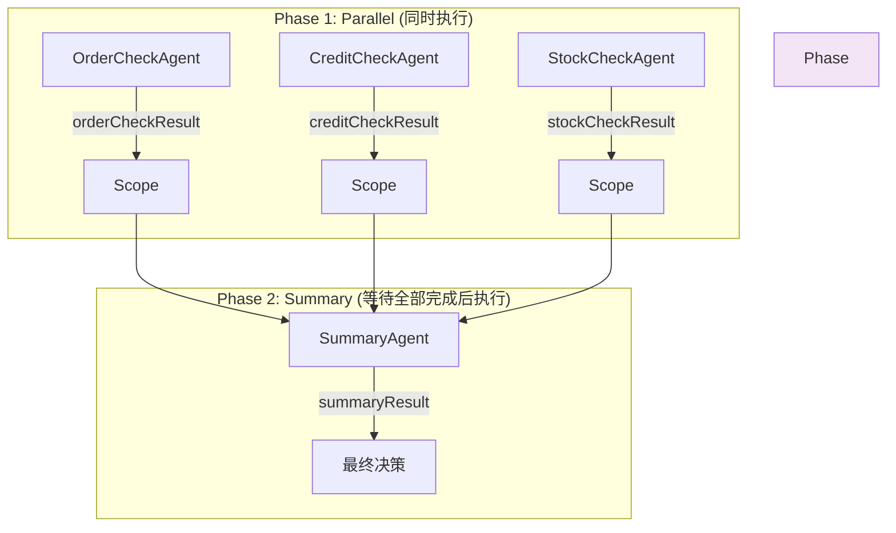

### 5.5 时序对比

| 模式 | 顺序执行（Sequential） | 并行执行（Parallel） |
|------|----------------------|---------------------|
| 耗时 | T₁ + T₂ + T₃ | max(T₁, T₂, T₃) + T₄ |
| 适用 | 有数据依赖的步骤 | 互不依赖的独立检查 |

---

## 6. 模式三：Loop — 迭代优化

### 6.1 场景描述

> **业务需求：** 自动生成售后回复文案，通过"起草→评审"循环迭代，直到评分达到 8 分以上才输出。

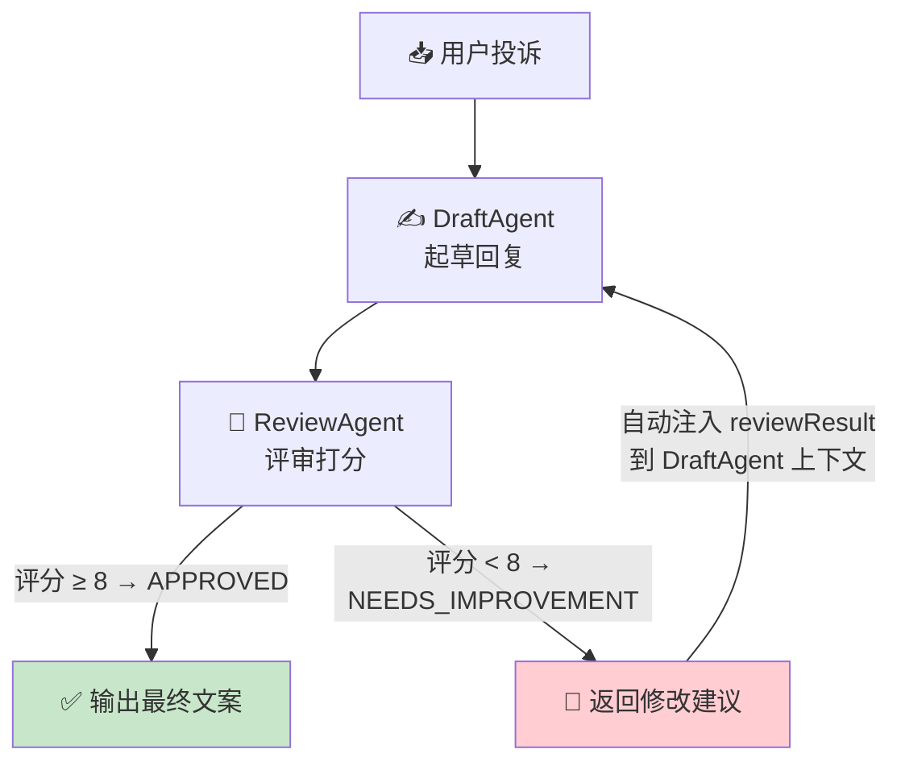

### 6.2 关键特征

- **质量门控**：通过评分/检查条件自动决定是否重试
- **退出条件**：必须定义 `exitCondition` 和 `maxIterations`
- **上下文注入**：上一轮的输出自动注入到下一轮输入

### 6.3 代理间上下文传递的关键设计

DraftAgent 使用 `summarizedContext` 自动接收上一轮的评审反馈：

```java
// DraftAgent.java — 注意 summarizedContext 参数
public interface DraftAgent {
    @Agent(name = "DraftAgent",
            description = "文案起草Agent",
            outputKey = "draftReply",
            summarizedContext = {"reviewResult"}   // ← 关键！
    )
    String draftReply(@V("orderId") String orderId, @V("reason") String reason);
}
```

**`summarizedContext = {"reviewResult"}`** 的含义：
- 每次循环迭代时，自动将上一轮 ReviewAgent 的 `reviewResult` 注入到 DraftAgent 的上下文
- 首次迭代时 Scope 中没有 `reviewResult`，不会报错，DraftAgent 直接起草
- 后续迭代时，DraftAgent 会收到"上次评审说XXX，请改进"

### 6.4 代码实现

```java
@Service
public class LoopService {
    private final LoopReplyWorkflow loopReplyWorkflow;

    public LoopService(ChatModel chatModel, AfterSalesTools tools) {
        // 1. DraftAgent — 负责起草和修改
        DraftAgent draftAgent = AgenticServices
            .agentBuilder(DraftAgent.class).chatModel(chatModel)
            .tools(tools).outputKey("draftReply").build();

        // 2. ReviewAgent — 负责评审和打分
        ReviewAgent reviewAgent = AgenticServices
            .agentBuilder(ReviewAgent.class).chatModel(chatModel)
            .outputKey("reviewResult").build();

        // 3. 退出条件：reviewResult 包含 "APPROVED"
        Predicate<AgenticScope> exitCondition = scope -> {
            String result = scope.readState("reviewResult", "");
            return result.contains("APPROVED");
        };

        // 4. 组装 Loop 工作流
        this.loopReplyWorkflow = AgenticServices
            .loopBuilder(LoopReplyWorkflow.class)
            .subAgents(draftAgent, reviewAgent)   // ← 循环执行这两个
            .exitCondition(exitCondition)          // ← 何时退出循环
            .maxIterations(3)                      // ← 最多 3 轮（防止死循环）
            .outputKey("reviewResult")
            .build();
    }
}
```

### 6.5 执行流程可视化

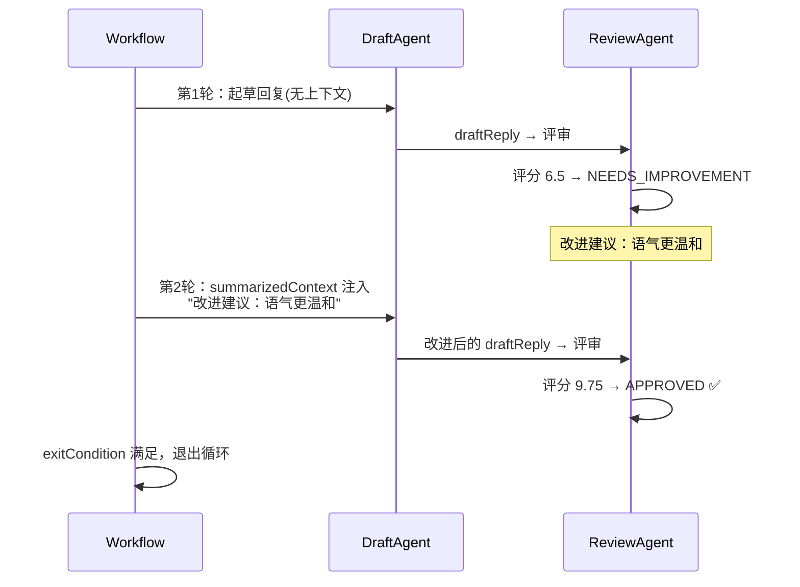

---

## 7. 模式四：Conditional — 条件分流

### 7.1 场景描述

> **业务需求：** 根据退款原因自动分类，走不同的处理通道。

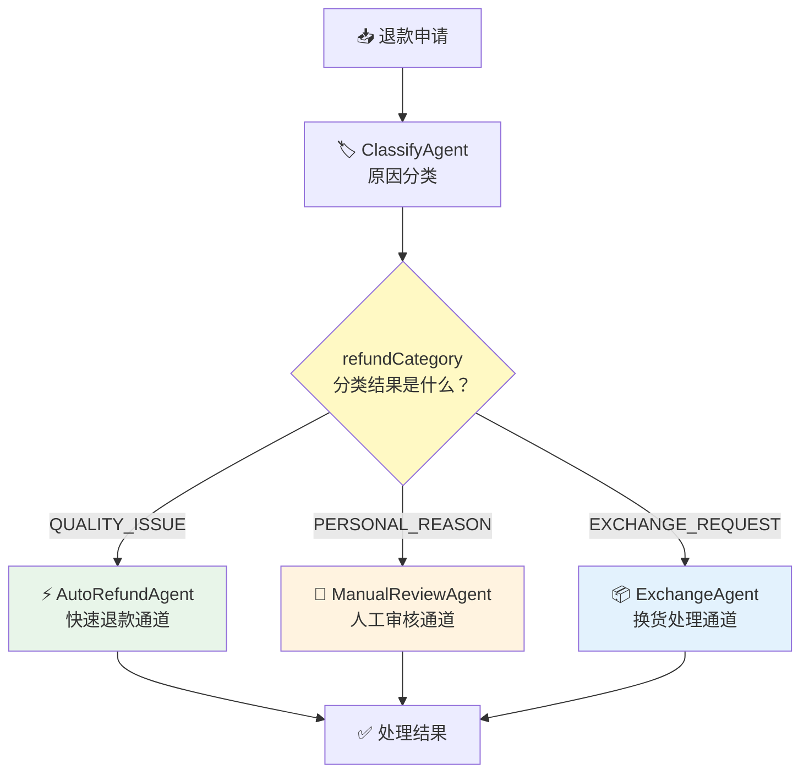

### 7.2 关键特征

- **分支路由**：类似编程中的 `if-else` 或 `switch`
- **Predicate 判断**：用 Java `Predicate<AgenticScope>` 做条件判断
- **精确匹配**：多个分支时按注册顺序匹配，命中第一个即停止

### 7.3 代码实现

```java
@Service
public class ConditionalService {
    private final ConditionalRefundWorkflow conditionalRefundWorkflow;

    public ConditionalService(ChatModel chatModel, AfterSalesTools tools) {
        // 1. 分类 Agent
        ClassifyAgent classifyAgent = AgenticServices
            .agentBuilder(ClassifyAgent.class).chatModel(chatModel)
            .tools(tools).outputKey("refundCategory")   // ← 存入分类结果
            .build();

        // 2. 三个通道 Agent
        AutoRefundAgent autoRefund = AgenticServices
            .agentBuilder(AutoRefundAgent.class).chatModel(chatModel)
            .tools(tools).outputKey("processResult").build();

        ManualReviewAgent manualReview = AgenticServices
            .agentBuilder(ManualReviewAgent.class).chatModel(chatModel)
            .tools(tools).outputKey("processResult").build();

        ExchangeAgent exchange = AgenticServices
            .agentBuilder(ExchangeAgent.class).chatModel(chatModel)
            .tools(tools).outputKey("processResult").build();

        // 3. 条件谓词：读取 ClassifyAgent 的输出做判断
        Predicate<AgenticScope> isQuality = s ->
            s.readState("refundCategory", "").contains("QUALITY_ISSUE");
        Predicate<AgenticScope> isPersonal = s ->
            s.readState("refundCategory", "").contains("PERSONAL_REASON");
        Predicate<AgenticScope> isExchange = s ->
            s.readState("refundCategory", "").contains("EXCHANGE_REQUEST");

        // 4. 构建条件路由块
        UntypedAgent conditionalBlock = AgenticServices
            .conditionalBuilder()
            .subAgents(isQuality, autoRefund)      // if quality → auto refund
            .subAgents(isPersonal, manualReview)   // else if personal → manual
            .subAgents(isExchange, exchange)       // else if exchange → exchange
            .outputKey("processResult")
            .build();

        // 5. 串联：分类 → 条件路由
        this.conditionalRefundWorkflow = AgenticServices
            .sequenceBuilder(ConditionalRefundWorkflow.class)
            .subAgents(classifyAgent, conditionalBlock)
            .outputKey("processResult")
            .build();
    }
}
```

### 7.4 条件匹配规则

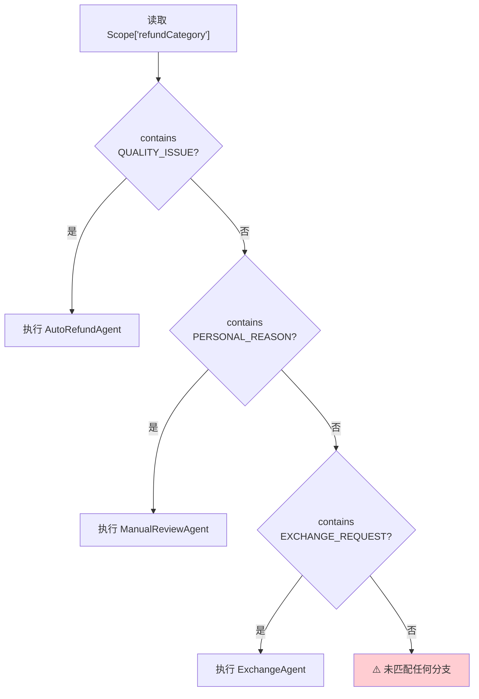

> ⚠️ **注意**：建议确保所有可能的分支都有 Predicate 覆盖，否则工作流会无法执行任何分支。

---

## 8. 模式五：Supervisor — 主管调度

### 8.1 场景描述

> **业务需求：** 面对复杂售后诉求（投诉 + 赔偿 + 情绪激烈），由 Supervisor Agent 自主编排子 Agent 的执行计划。

这与前四种模式最大的区别在于：**流程不是预先写死的，而是由 LLM 在运行时动态决定的**。

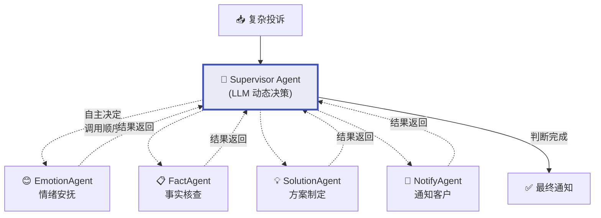

### 8.2 关键特征

- **完全动态**：不预设执行顺序，由 Supervisor 根据输入自主决策
- **LLM 驱动的决策中枢**：Supervisor 本身也是 LLM，它理解任务并规划步骤
- **可重复调用**：可以多次调用同一个子 Agent（比如先安抚情绪，调查后发现没解决，再安抚）
- **需要限制**：必须有 `maxAgentsInvocations()` 防止无限循环

### 8.3 Supervisor 上下文设计

Supervisor 的"智慧"来自 `supervisorContext` 中的 Prompt：

```java
@Service
public class SupervisorService {
    private final SupervisorWorkflow supervisorWorkflow;

    public SupervisorService(ChatModel chatModel, AfterSalesTools tools) {
        // 1. 构建四个子 Agent（和前面一样的方式）
        EmotionAgent emotionAgent = AgenticServices
            .agentBuilder(EmotionAgent.class).chatModel(chatModel)
            .tools(tools).outputKey("emotionResult").build();
        
        FactAgent factAgent = AgenticServices
            .agentBuilder(FactAgent.class).chatModel(chatModel)
            .tools(tools).outputKey("factResult").build();
        
        SolutionAgent solutionAgent = AgenticServices
            .agentBuilder(SolutionAgent.class).chatModel(chatModel)
            .outputKey("solutionResult").build();
        
        NotifyAgent notifyAgent = AgenticServices
            .agentBuilder(NotifyAgent.class).chatModel(chatModel)
            .outputKey("notifyResult").build();

        // 2. 🔑 核心：Supervisor 的上下文提示词
        String supervisorContext = """
            你是电商售后主管，负责协调处理复杂的用户投诉。
            
            你可以调度以下子 Agent：
            1. EmotionAgent - 情绪安抚：分析用户情绪，生成安抚话术
            2. FactAgent - 事实调查：查询订单和用户信息，梳理事实
            3. SolutionAgent - 方案制定：综合情绪和事实，制定处理方案
            4. NotifyAgent - 通知执行：生成客户通知文案并执行
            
            请根据用户投诉内容，自主决定：
            - 需要调用哪些子 Agent
            - 调用顺序
            - 是否需要重复调用某个 Agent
            - 何时完成处理
            
            通常的处理流程是：情绪安抚 → 事实调查 → 方案制定 → 通知执行，
            但你可以根据具体情况灵活调整。
            """;

        // 3. 请求生成器：从方法参数构建 Supervisor 的输入
        Function<AgenticScope, String> requestGenerator = scope -> {
            String orderId = scope.readState("orderId", "");
            String complaint = scope.readState("complaint", "");
            return "请处理以下售后投诉：\n订单ID: " + orderId + "\n用户投诉: " + complaint;
        };

        // 4. 输出提取器：从 Scope 中提取最终结果
        Function<AgenticScope, Object> outputExtractor = scope -> {
            String notifyResult = scope.readState("notifyResult", "");
            if (!notifyResult.isEmpty()) return notifyResult;
            return scope.readState("solutionResult", "处理未完成");
        };

        // 5. 构建 Supervisor 工作流
        this.supervisorWorkflow = AgenticServices
            .supervisorBuilder(SupervisorWorkflow.class)
            .chatModel(chatModel)
            .name("AfterSalesSupervisor")
            .description("电商售后主管，动态调度子Agent处理复杂投诉")
            .supervisorContext(supervisorContext)       // ← 告诉 Supervisor 有哪些兵
            .requestGenerator(requestGenerator)          // ← 如何构建初始请求
            .subAgents(emotionAgent, factAgent, solutionAgent, notifyAgent)
            .maxAgentsInvocations(8)                     // ← 最多调用 8 次子 Agent
            .output(outputExtractor)                     // ← 如何提取最终结果
            .outputKey("finalResult")
            .build();
    }
}
```

### 8.4 Supervisor vs Sequential 对比

| 维度 | Sequential（顺序） | Supervisor（主管） |
|------|-------------------|-------------------|
| 流程 | **编译时确定** | **运行时动态** |
| 灵活性 | 低（固定路由） | 高（自主决策） |
| 可预测性 | 高（每次都一样） | 低（每次可能不同） |
| 可控性 | 强（开发者决定） | 弱（依赖 LLM 判断力） |
| 适用 | 标准化流程 | 复杂多变场景 |
| 成本 | 低（确定 LLM 调用次数） | 较高（可能多轮调度） |

---

## 9. 模式六：HumanInTheLoop — 人工介入

### 9.1 场景描述

> **业务需求：** 大额退款需人工审批，Agent 完成前置检查后自动暂停，等待主管审批后恢复执行。

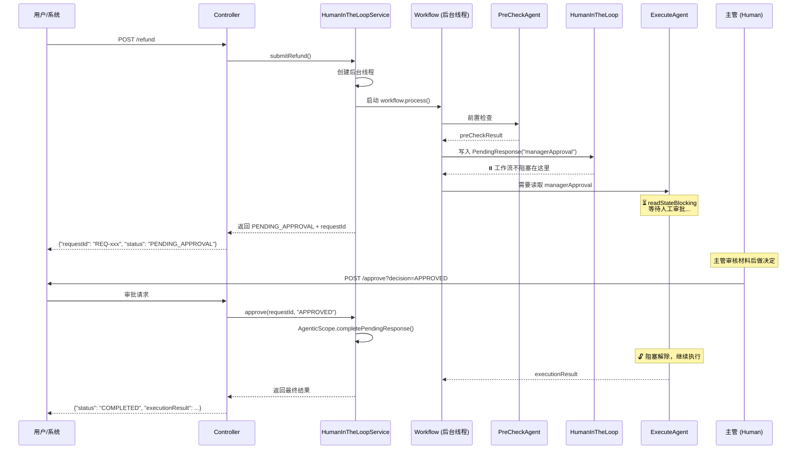

### 9.2 关键特征

- **双步交互**：第一步提交申请 → 工作流暂停；第二步人工审批 → 工作流恢复
- **后台线程阻塞**：工作流在后台线程运行，读取 PendingResponse 时阻塞
- **外部恢复**：通过 `AgenticScope.completePendingResponse()` 注入结果恢复
- **MemoryId 绑定**：`@MemoryId` 将 requestId 绑定到唯一 AgenticScope

### 9.3 代码实现——六个关键步骤

#### Step 1：Workflow 接口用 @MemoryId 绑定会话

```java
public interface HumanApprovalWorkflow {
    String process(
        @MemoryId String requestId,   // ← 绑定会话ID
        @V("orderId") String orderId,
        @V("reason") String reason,
        @V("amount") double amount
    );
}
```

#### Step 2：HumanInTheLoop Agent 返回 PendingResponse

```java
HumanInTheLoop humanApprovalAgent = AgenticServices
    .humanInTheLoopBuilder()
    .description("暂停工作流，等待售后主管对大额退款进行人工审批")
    .outputKey("managerApproval")
    .responseProvider(scope -> {
        log.info("Workflow paused, waiting for manager approval");
        return new PendingResponse<>("managerApproval");
        // ↑ 写入 Scope，ExecuteAgent 读取时触发阻塞
    })
    .build();
```

#### Step 3：用 sequenceBuilder 串联

```java
this.workflow = AgenticServices
    .sequenceBuilder(HumanApprovalWorkflow.class)
    .subAgents(preCheckAgent, humanApprovalAgent, executeAgent)
    .outputKey("executionResult")
    .build();
```

#### Step 4：后台线程提交+等待暂停

```java
public Map<String, Object> submitRefund(String orderId, String reason, double amount) {
    String requestId = "REQ-" + UUID.randomUUID().toString().substring(0, 8);

    // 后台线程启动工作流（它会阻塞在 ExecuteAgent 读取 managerApproval 处）
    Future<String> future = executor.submit(
        () -> workflow.process(requestId, orderId, reason, amount)
    );
    runningWorkflows.put(requestId, future);

    // 轮询等待 HumanInTheLoop 写入 PendingResponse
    AgenticScope scope = awaitPause(requestId, future);

    return Map.of(
        "requestId", requestId,
        "status", "PENDING_APPROVAL",
        "preCheckResult", scope.readState("preCheckResult", "")
    );
}
```

#### Step 5：轮询检测暂停点

```java
private AgenticScope awaitPause(String requestId, Future<String> future) {
    AgenticScopeAccess access = (AgenticScopeAccess) workflow;
    long deadline = System.currentTimeMillis() + 60_000L;
    
    while (System.currentTimeMillis() < deadline) {
        if (future.isDone()) return access.getAgenticScope(requestId);
        
        AgenticScope scope = access.getAgenticScope(requestId);
        // 🔍 检查 PendingResponse 是否已写入
        if (scope != null && scope.pendingResponseIds().contains(APPROVAL_KEY)) {
            return scope;  // ← 找到了！工作流已到达暂停点
        }
        Thread.sleep(200);
    }
    throw new RuntimeException("等待暂停点超时");
}
```

#### Step 6：人工审批恢复工作流

```java
public Map<String, Object> approve(String requestId, String decision, String comment) {
    Future<String> future = runningWorkflows.get(requestId);
    
    // 🔑 通过 AgenticScopeAccess 定位到指定会话的 Scope
    AgenticScope scope = ((AgenticScopeAccess) workflow).getAgenticScope(requestId);
    
    String approvalText = decision + (comment != null ? " - " + comment : "");
    // 🔓 注入审批结果，解除 ExecuteAgent 的阻塞
    scope.completePendingResponse(APPROVAL_KEY, approvalText);
    
    // 等待工作流完成
    String result = future.get(120, TimeUnit.SECONDS);
    
    runningWorkflows.remove(requestId);
    return Map.of("requestId", requestId, "status", "COMPLETED", "executionResult", result);
}
```

### 9.4 HumanInTheLoop 的执行时序

```mermaid
gantt
    title HumanInTheLoop 工作流执行时序
    dateFormat HH:mm:ss
    axisFormat %M:%S
    
    section 主线程
    提交申请 submitRefund    :active, t1, 00:00:00, 00:00:01
    轮询等待暂停点           :t2, 00:00:01, 00:00:05
    返回 PENDING_APPROVAL    :crit, t3, 00:00:05, 00:00:06
    等待人工决策 (任意时长)  :t4, 00:00:06, 00:02:00
    审批调用 approve         :active, t5, 00:02:00, 00:02:02
    completePendingResponse  :t6, 00:02:02, 00:02:02
    等待工作流完成           :t7, 00:02:02, 00:02:10
    返回 COMPLETED           :crit, t8, 00:02:10, 00:02:11
    
    section 后台工作流线程
    PreCheckAgent            :active, w1, 00:00:01, 00:00:04
    HumanInTheLoop 写入      :w2, 00:00:04, 00:00:05
    ExecuteAgent 阻塞等待    :crit, w3, 00:00:05, 00:02:02
    ExecuteAgent 恢复执行    :active, w4, 00:02:02, 00:02:09
    工作流完成               :done, w5, 00:02:09, 00:02:10
```

---

## 10. 模式对比与选型指南

### 10.1 六种模式总览

| 模式 | Builder | 拓扑结构 | 决策方式 | LLM调用量 | 适用场景 |
|------|---------|----------|----------|-----------|----------|
| **Sequential** | `sequenceBuilder` | 线形 A→B→C | 编译时固定 | 确定（每个Agent一次） | 审批流、ETL管道 |
| **Parallel** | `parallelBuilder` | 扇形汇合 | 编译时固定 | 确定 | 独立检查、多维度评估 |
| **Loop** | `loopBuilder` | 循环 A⇄B | 运行时 exitCondition | 变量（多轮） | 内容生成+质量门控 |
| **Conditional** | `conditionalBuilder` | 树形分支 | 运行时 Predicate | 确定（但路径可变） | 分类路由、多通道处理 |
| **Supervisor** | `supervisorBuilder` | LLM动态 | LLM自主决策 | 不确定 | 复杂多变场景 |
| **HumanInTheLoop** | `humanInTheLoopBuilder` | 暂停点注入 | 外部人工输入 | 确定+暂停 | 需要审批的业务流程 |

### 10.2 选型决策树

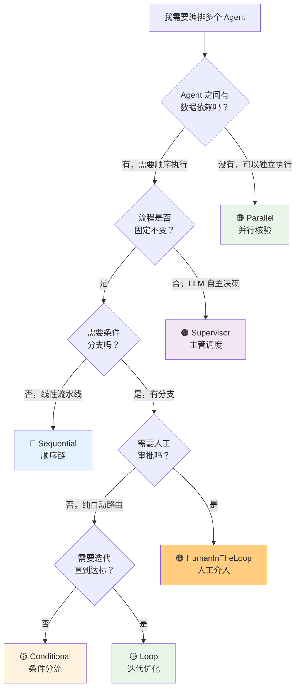

### 10.3 组合使用

真实场景中，多种模式往往组合使用。例如本项目中的 **Parallel + Sequential**：

```
ParallelBlock (OrderCheck + CreditCheck + StockCheck)  →  SummaryAgent
       ↑ parallelBuilder                                      ↑ sequenceBuilder
```

你也可以想象 **Conditional + Loop + HumanInTheLoop** 的组合：

```
ClassifyAgent → 条件分流:
  ├─ 质量问题 → Loop(Draft → Review 直到达标) → 自动发送
  └─ 大额退款 → HumanInTheLoop (前置检查 → 暂停 → 主管审批 → 执行)
```

---

## 11. 最佳实践与踩坑经验

### 11.1 Prompt 设计原则

1. **明确角色和边界**：每个 Agent 的 `@UserMessage` 要清晰定义"你是谁、做什么、输出什么格式"

2. **结构化输出**：要求 Agent 输出格式化文本（如 `风险等级: [HIGH/MEDIUM/LOW]`），方便下游解析和条件判断

3. **指示工具调用时机**：在 Prompt 中明确告知"请先调用工具查询XXX信息，然后..."

4. **提供业务规则**：把决策规则写在 Prompt 里，而不是靠训练数据

```java
// ✅ 好的 Prompt 示例
@UserMessage("""
    你是风控专员。
    请先调用工具查询订单和用户信息，然后根据以下规则评估：
    1. 高风险：历史退款≥3次 且 订单>500元
    2. 低风险：首次退款 或 VIP用户
    
    返回格式（严格遵循）：
    风险等级: [HIGH/MEDIUM/LOW]
    风险评分: [0-100]
    """)

// ❌ 不好的 Prompt — 太模糊
@UserMessage("请帮我看一下这个退款有没有风险")
```

### 11.2 Agent 命名和 outputKey

- **outputKey 是 Agent 之间的"契约"**：上游 outputKey 和下游 @V 参数名必须一致
- **命名要有语义**：用 `riskResult` 而不是 `r1`，用 `financeResult` 而不是 `step2`
- **避免冲突**：确保不同 Agent 的 outputKey 不重复（除非有意覆盖）

### 11.3 工具 (Tool) 设计

- **单一职责**：一个 Tool 方法只做一件事
- **清晰的描述**：`@Tool("描述")` 决定了 Agent 什么时候会调用它
- **参数说明**：`@P("说明")` 帮助 LLM 正确传参

```java
// ✅ 好的 Tool
@Tool("查询订单信息，包括订单号、商品、状态、金额等")
public String queryOrder(@P("订单ID，如 ORD-001") String orderId) { ... }

// ❌ 不好的 Tool — 描述太泛
@Tool("查东西")
public String query(String id) { ... }
```

### 11.4 Loop 模式注意事项

1. **必须设 maxIterations**：防止 LLM 无限循环，建议 3-10
2. **退出条件要可靠**：不要依赖 LLM 输出特定字符串（可能不稳定），考虑数值比较
3. **summarizedContext 是银弹**：用于自动传递上一轮反馈，无需手写循环变量

### 11.5 Supervisor 模式注意事项

1. **supervisorContext 质量决定效果**：详细列出每个子 Agent 的职责和能力
2. **必须设 maxAgentsInvocations**：Supervisor 可能会重复调度
3. **outputExtractor 是保险**：确保总能提取到有意义的最终结果
4. **成本可控性差**：Supervisor 的 LLM 调用次数不确定，不适合预算严格控制的场景

### 11.6 HumanInTheLoop 模式注意事项

1. **后台线程管理**：确保线程池合理配置，防止线程泄漏
2. **会话清理**：审批完成后及时 `evictAgenticScope()`，防止内存泄漏
3. **超时机制**：awaitPause 要有超时，future.get() 也要有超时
4. **幂等性**：`completePendingResponse` 重复调用应安全（框架已处理）

### 11.7 调试技巧

```yaml
# 开启调试日志，观察每个 Agent 的输入输出和 LLM 调用
logging:
  level:
    dev.langchain4j: DEBUG
    com.example.agentic: DEBUG

langchain4j:
  open-ai:
    chat-model:
      log-requests: true    # 打印每次 LLM 请求
      log-responses: true   # 打印每次 LLM 响应
```

### 11.8 常见错误与解决

| 错误现象 | 可能原因 | 解决方法 |
|----------|----------|----------|
| Agent 不调用 Tool | Prompt 没指示调用工具 | 在 Prompt 中加"请先调用工具查询..." |
| outputKey 读取到 null | key 不匹配或 Agent 未执行 | 检查 outputKey 拼写、确认 Agent 执行顺序 |
| Loop 不退出 | exitCondition 永远不满足 | 检查条件逻辑、增加 maxIterations |
| Conditional 不匹配 | Predicate 没覆盖所有情况 | 添加兜底分支或确保分类结果在预期枚举内 |
| HumanInTheLoop 超时 | 轮询时间不够或 PendingResponse 未写入 | 增加 awaitPause 超时、检查 humanInTheLoopBuilder 配置 |

---

## 附录 A：完整项目依赖

```xml
<!-- pom.xml 核心依赖 -->
<dependencies>
    <dependency>
        <groupId>org.springframework.boot</groupId>
        <artifactId>spring-boot-starter-web</artifactId>
    </dependency>
    <dependency>
        <groupId>dev.langchain4j</groupId>
        <artifactId>langchain4j-agentic</artifactId>
        <version>1.16.0-beta26</version>
    </dependency>
    <dependency>
        <groupId>dev.langchain4j</groupId>
        <artifactId>langchain4j-spring-boot-starter</artifactId>
        <version>1.16.0-beta26</version>
    </dependency>
    <dependency>
        <groupId>dev.langchain4j</groupId>
        <artifactId>langchain4j-open-ai-spring-boot-starter</artifactId>
        <version>1.16.0-beta26</version>
    </dependency>
    <dependency>
        <groupId>org.projectlombok</groupId>
        <artifactId>lombok</artifactId>
        <scope>provided</scope>
    </dependency>
</dependencies>
```

## 附录 B：测试数据

| 订单ID | 用户 | VIP等级 | 商品 | 金额 | 历史退款 | 特点 |
|--------|------|---------|------|------|----------|------|
| ORD-001 | 张三 | NORMAL | 蓝牙耳机 | ¥299 | 0次 | 低风险、正常退款 |
| ORD-002 | 李四 | VIP | 机械键盘 | ¥599 | 1次 | 中等风险 |
| ORD-003 | 王五 | NORMAL | 运动跑鞋×2 | ¥918 | 4次 | 高风险、大额 |

## 附录 C：API 速查

| 模式 | 端点 | 方法 | 参数 |
|------|------|------|------|
| Sequential | `/api/sequential/refund` | POST | orderId, reason |
| Parallel | `/api/parallel/check` | POST | orderId, reason |
| Loop | `/api/loop/reply` | POST | orderId, reason |
| Conditional | `/api/conditional/refund` | POST | orderId, reason |
| Supervisor | `/api/supervisor/handle` | POST | orderId, complaint |
| HumanInTheLoop | `/api/humanintheloop/refund` | POST | orderId, reason, amount |
| HumanInTheLoop | `/api/humanintheloop/approve` | POST | requestId, decision, comment |

---

> 📖 本文档基于 [LangChain4j Agentic Workflow Demo](https://github.com/langchain4j) 项目编写
>
> 技术栈：Java 17 + Spring Boot 3.5 + LangChain4j 1.16.0-beta26
