# LangChain4j Agent 编排实战教程

> 面向 Java 程序员的 AI Agent 工作流编排入门指南
>
> 基于 LangChain4j 1.16 Agentic API，以电商智能售后场景为案例

---

## 目录

1. [什么是 Agent 编排](#1-什么是-agent-编排)
2. [核心概念速览](#2-核心概念速览)
3. [环境与项目搭建](#3-环境与项目搭建)
4. [模式一：Sequential — 顺序串联](#4-模式一sequential--顺序串联)
5. [模式二：Parallel — 并行分发](#5-模式二parallel--并行分发)
6. [模式三：Loop — 迭代优化](#6-模式三loop--迭代优化)
7. [模式四：Conditional — 条件分流](#7-模式四conditional--条件分流)
8. [模式五：Supervisor — 主管调度](#8-模式五supervisor--主管调度)
9. [模式六：HumanInTheLoop — 人工介入](#9-模式六humanintheloop--人工介入)
10. [模式对比与选型指南](#10-模式对比与选型指南)
11. [最佳实践与踩坑经验](#11-最佳实践与踩坑经验)

---

## 1. 什么是 Agent 编排

### 1.1 从单个 LLM 调用到多 Agent 协作

传统的 LLM 调用模式是"一问一答"：

```
用户输入 → LLM 推理 → 输出结果
```

但在真实业务场景中，复杂任务往往需要**多个步骤**、**多个决策点**、**工具调用**、**并行处理**甚至是**人工审批节点**。这就是 Agent 编排要解决的问题。

Agent 编排（Agentic Workflow）是指：**将多个 AI Agent 按照特定的拓扑结构组织起来，让它们像流水线一样协作处理复杂任务**。

### 1.2 一个直观的类比

想象一个电商售后团队：

| 传统单 LLM 模式 | Agent 编排模式 |
|---|---|
| 一个通才包办所有事情 | 风控专员 → 财务专员 → 客服主管（各司其职） |
| 出错时全部重来 | 单独某步可以重试/修正 |
| 不能并行 | 可以同时核验订单、信用、库存 |
| 无法插入人工审核 | 可以在任意节点暂停等人工决策 |

### 1.3 本项目中的六种编排模式

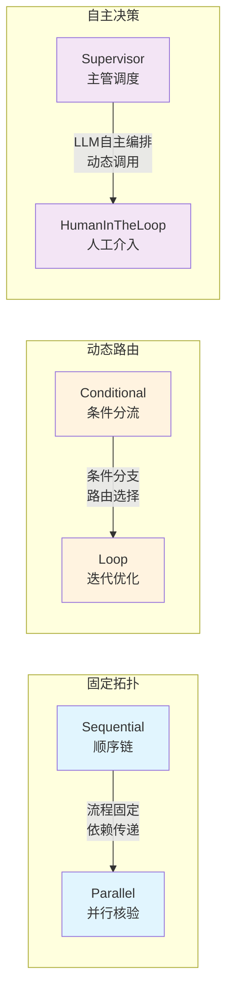
```mermaid
graph LR
    subgraph "固定拓扑"
        A[Sequential<br/>顺序链] 
        B[Parallel<br/>并行核验]
    end
    subgraph "动态路由"
        C[Conditional<br/>条件分流]
        D[Loop<br/>迭代优化]
    end
    subgraph "自主决策"
        E[Supervisor<br/>主管调度]
        F[HumanInTheLoop<br/>人工介入]
    end
    
    A -->|流程固定<br/>依赖传递| B
    C -->|条件分支<br/>路由选择| D
    E -->|LLM自主编排<br/>动态调用| F
    
    style A fill:#e1f5fe
    style B fill:#e1f5fe
    style C fill:#fff3e0
    style D fill:#fff3e0
    style E fill:#f3e5f5
    style F fill:#f3e5f5
```

---

## 2. 核心概念速览

在深入代码之前，先了解 LangChain4j Agentic API 的几个关键概念：

### 2.1 Agent（智能体）

Agent 是一个**由 LLM 驱动的、能调用工具完成特定任务的代理**。它用 Java 接口声明，`@Agent` 注解标识：

```java
public interface RiskAgent {
    @Agent(name = "RiskAgent",
            description = "风控检查Agent",
            outputKey = "riskResult")
    String assessRisk(@V("orderId") String orderId, @V("reason") String reason);
}
```

关键元素：
- **`@Agent`**：声明这是一个 Agent，指定名称、描述和输出键
- **`@UserMessage`**：Agent 的系统提示词（Prompt），定义角色和任务
- **`@V("xxx")`**：从 AgenticScope 中读取/绑定变量
- **`outputKey`**：执行结果写入 AgenticScope 的键名

### 2.2 AgenticScope（共享上下文）

AgenticScope 是整个工作流的**共享内存**。Agent 之间不直接传参，而是通过 Scope 读写数据：

```
Agent A 执行 → 写入 Scope["riskResult"] = "..."
Agent B 执行 → 通过 @V("riskResult") 读取
```

这类似于编程中的"全局变量"或 Map，但它是类型安全且工作流级别的。

### 2.3 Tool（工具）

Tool 是 Agent 的"手脚"——让 LLM 能够查询数据库、调用 API、操作业务系统。用 `@Tool` 注解暴露给 Agent：

```java
@Tool("查询订单信息")
public String queryOrder(@P("订单ID") String orderId) { ... }

@Tool("查询用户信息")
public String queryUser(@P("用户ID") String userId) { ... }
```

Agent 会根据 Prompt 中的指引，自动决定何时调用哪个 Tool。

### 2.4 Builder 体系

LangChain4j Agentic 提供了五种 Builder，对应不同的编排模式：

| Builder | 作用 | 关键方法 |
|----------|------|----------|
| `agentBuilder()` | 构建单个 Agent | `.tools()`, `.outputKey()` |
| `sequenceBuilder()` | 顺序串联 Agent | `.subAgents(a, b, c)` |
| `parallelBuilder()` | 并行分发 Agent | `.subAgents(a, b, c)` |
| `conditionalBuilder()` | 条件路由（if/else） | `.subAgents(predicate, agent)` |
| `loopBuilder()` | 循环迭代 | `.exitCondition()`, `.maxIterations()` |
| `supervisorBuilder()` | LLM 驱动动态调度 | `.supervisorContext()` |
| `humanInTheLoopBuilder()` | 暂停等人工（低级 API） | `.responseProvider()` |
| `@HumanInTheLoop` 注解 | 暂停等人工（声明式，推荐） | 标注静态方法，返回 `PendingResponse` |

### 2.5 技术栈一览

| 组件 | 版本 | 说明 |
|------|------|------|
| Java | 17 | 运行环境 |
| Spring Boot | 3.5.3 | 应用框架 |
| LangChain4j | 1.16.0-beta26 | Agentic API |
| LLM | agnes-2.0-flash | 兼容 OpenAI 格式 |
| 构建 | Maven | 依赖管理 |

---

## 3. 环境与项目搭建

### 3.1 Maven 依赖

核心依赖只有三个：

```xml
<!-- Agentic API（工作流编排核心） -->
<dependency>
    <groupId>dev.langchain4j</groupId>
    <artifactId>langchain4j-agentic</artifactId>
    <version>1.16.0-beta26</version>
</dependency>

<!-- Spring Boot Starter（自动装配 ChatModel、OpenAI 等） -->
<dependency>
    <groupId>dev.langchain4j</groupId>
    <artifactId>langchain4j-spring-boot-starter</artifactId>
    <version>1.16.0-beta26</version>
</dependency>

<!-- OpenAI 兼容适配 -->
<dependency>
    <groupId>dev.langchain4j</groupId>
    <artifactId>langchain4j-open-ai-spring-boot-starter</artifactId>
    <version>1.16.0-beta26</version>
</dependency>
```

### 3.2 应用配置

```yaml
langchain4j:
  open-ai:
    chat-model:
      api-key: sk-xxx
      base-url: https://your-llm-endpoint/v1   # 支持任何 OpenAI 兼容服务
      model-name: your-model-name
      temperature: 0.7
```

### 3.3 项目结构

```text
src/main/java/com/example/agentic/
├── common/
│   ├── model/          # Order, Product, User 等数据模型
│   ├── service/        # MockDataService（模拟数据）
│   └── tool/           # AfterSalesTools（@Tool 工具类）
├── sequential/         # 模式一：顺序审批链
│   ├── RefundWorkflow.java
│   ├── agent/          # RiskAgent, FinanceAgent, ServiceAgent
│   ├── service/        # SequentialService
│   └── controller/     # SequentialController
├── parallel/           # 模式二：并行核验
├── loop/               # 模式三：迭代优化
├── conditional/        # 模式四：条件分流
├── supervisor/         # 模式五：主管调度
├── humanintheloop/     # 模式六：人工介入（@HumanInTheLoop 注解 + PendingResponse）
│   ├── RefundWorkflow.java          # 顺序工作流接口（@MemoryId 绑定会话）
│   ├── agent/
│   │   ├── PreCheckAgent.java        # LLM Agent：前置检查（AiServices）
│   │   ├── RefundApprovalAgent.java  # @HumanInTheLoop 注解：返回 PendingResponse
│   │   └── ExecuteAgent.java         # LLM Agent：执行/驳回退款（AiServices）
│   ├── service/ApprovalService.java # 创建 CompletableFuture、序列化落库、审批/恢复
│   ├── controller/
│   │   ├── HumanInTheLoopController.java  # /refund /approve /status
│   │   └── RecoveryController.java        # /simulate-restart /recover /recover/pending
│   ├── entity/HitlPendingEntity.java # 存序列化 PendingResponse 的记录
│   └── mapper/HitlPendingMapper.java
└── AgenticDemoApplication.java
```

---

## 4. 模式一：Sequential — 顺序串联

### 4.1 场景描述

> **业务需求：** 用户申请退款，依次经过风控、财务、客服三级审批，每步依赖前一步输出。

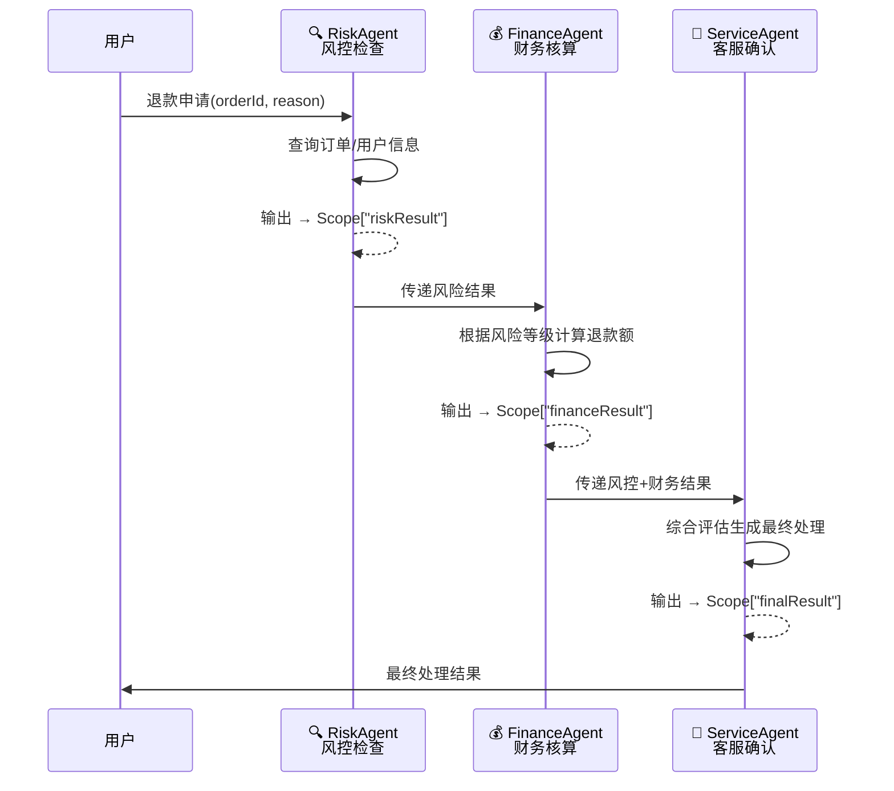
```mermaid
sequenceDiagram
    participant U as 用户
    participant R as 🔍 RiskAgent<br/>风控检查
    participant F as 💰 FinanceAgent<br/>财务核算
    participant S as 💬 ServiceAgent<br/>客服确认
    
    U->>R: 退款申请(orderId, reason)
    R->>R: 查询订单/用户信息
    R-->>R: 输出 → Scope["riskResult"]
    R->>F: 传递风险结果
    F->>F: 根据风险等级计算退款额
    F-->>F: 输出 → Scope["financeResult"]
    F->>S: 传递风控+财务结果
    S->>S: 综合评估生成最终处理
    S-->>S: 输出 → Scope["finalResult"]
    S->>U: 最终处理结果
```

### 4.2 关键特征

- **有向无环图（DAG）**：Agent A → Agent B → Agent C
- **数据依赖**：后续 Agent 依赖前面 Agent 的 outputKey
- **适用场景**：审批流、数据处理管道、分层推理

### 4.3 代码实现

#### Step 1：定义 Agent 接口

每个 Agent 是一个接口，核心是 `@UserMessage` 中的 Prompt 和 `@V` 参数绑定：

```java
// RiskAgent.java — 风控检查
public interface RiskAgent {
    @UserMessage("""
        你是电商售后风控专员。
        请根据以下退款申请信息进行风控评估。
        
        订单ID: {{orderId}}
        退款原因: {{reason}}
        
        请先调用工具查询订单和用户信息，然后评估风险等级：
        - 高风险(HIGH)：历史退款≥3次、金额>500且原因为个人
        - 中风险(MEDIUM)：退款1-2次、已签收且原因为个人
        - 低风险(LOW)：首次退款、质量问题、VIP用户
        
        返回格式：
        风险等级: [HIGH/MEDIUM/LOW]
        风险评分: [0-100]
        风险标签: [欺诈嫌疑/高频退款/正常退款/质量问题]
        """)
    @Agent(name = "RiskAgent",
            description = "风控检查Agent",
            outputKey = "riskResult")
    String assessRisk(@V("orderId") String orderId, @V("reason") String reason);
}
```

```java
// FinanceAgent.java — 财务核算
public interface FinanceAgent {
    @UserMessage("""
        你是电商售后财务专员。请根据风控评估结果核算退款金额。
        
        订单ID: {{orderId}}
        风控结果: {{riskResult}}
        
        核算规则：
        - 风控LOW：全额退款
        - 风控MEDIUM：退款80%，扣20%手续费
        - 风控HIGH：退款50%，扣50%违约金
        
        返回格式：
        订单金额: [原金额]
        退款金额: [实际退款]
        扣除金额: [扣除金额]
        """)
    @Agent(name = "FinanceAgent",
            description = "财务核算Agent，根据风控结果计算退款金额",
            outputKey = "financeResult")
    String calculateRefund(
        @V("orderId") String orderId, 
        @V("riskResult") String riskResult    // ← 从前一步读取
    );
}
```

```java
// ServiceAgent.java — 客服确认
public interface ServiceAgent {
    @UserMessage("""
        你是电商售后客服主管。综合风控和财务结果做出最终决定。
        
        订单ID: {{orderId}}
        退款原因: {{reason}}
        风控结果: {{riskResult}}
        财务核算结果: {{financeResult}}
        
        决定规则：
        - 风控LOW且财务全额退款 → 批准
        - 风控MEDIUM → 部分退款+补偿优惠券
        - 风控HIGH → 拒绝但保留申诉通道
        
        返回格式：
        处理结果: [APPROVED/PARTIAL_REFUND/REJECTED]
        最终退款金额: [金额]
        用户通知: [发送给客户的文案]
        """)
    @Agent(name = "ServiceAgent", outputKey = "finalResult")
    String finalizeResult(
        @V("orderId") String orderId,
        @V("reason") String reason,
        @V("riskResult") String riskResult,     // ← 读取前两步
        @V("financeResult") String financeResult  // ← 读取前两步
    );
}
```

#### Step 2：定义工作流接口

```java
// RefundWorkflow.java
public interface RefundWorkflow {
    @Agent
    String processRefund(
        @V("orderId") String orderId, 
        @V("reason") String reason
    );
}
```

#### Step 3：组装工作流

```java
@Service
public class SequentialService {
    private final RefundWorkflow refundWorkflow;

    public SequentialService(ChatModel chatModel, AfterSalesTools tools) {
        // 1. 构建三个子 Agent
        RiskAgent riskAgent = AgenticServices
            .agentBuilder(RiskAgent.class)
            .chatModel(chatModel)
            .tools(tools)          // ← 注入工具，让 Agent 能查询数据
            .outputKey("riskResult")
            .build();

        FinanceAgent financeAgent = AgenticServices
            .agentBuilder(FinanceAgent.class)
            .chatModel(chatModel)
            .tools(tools)
            .outputKey("financeResult")
            .build();

        ServiceAgent serviceAgent = AgenticServices
            .agentBuilder(ServiceAgent.class)
            .chatModel(chatModel)
            .tools(tools)
            .outputKey("finalResult")
            .build();

        // 2. 用 sequenceBuilder 串联
        this.refundWorkflow = AgenticServices
            .sequenceBuilder(RefundWorkflow.class)
            .subAgents(riskAgent, financeAgent, serviceAgent)  // ← 按顺序执行
            .outputKey("finalResult")
            .build();
    }

    public String processRefund(String orderId, String reason) {
        return refundWorkflow.processRefund(orderId, reason);
    }
}
```

### 4.4 数据流动图

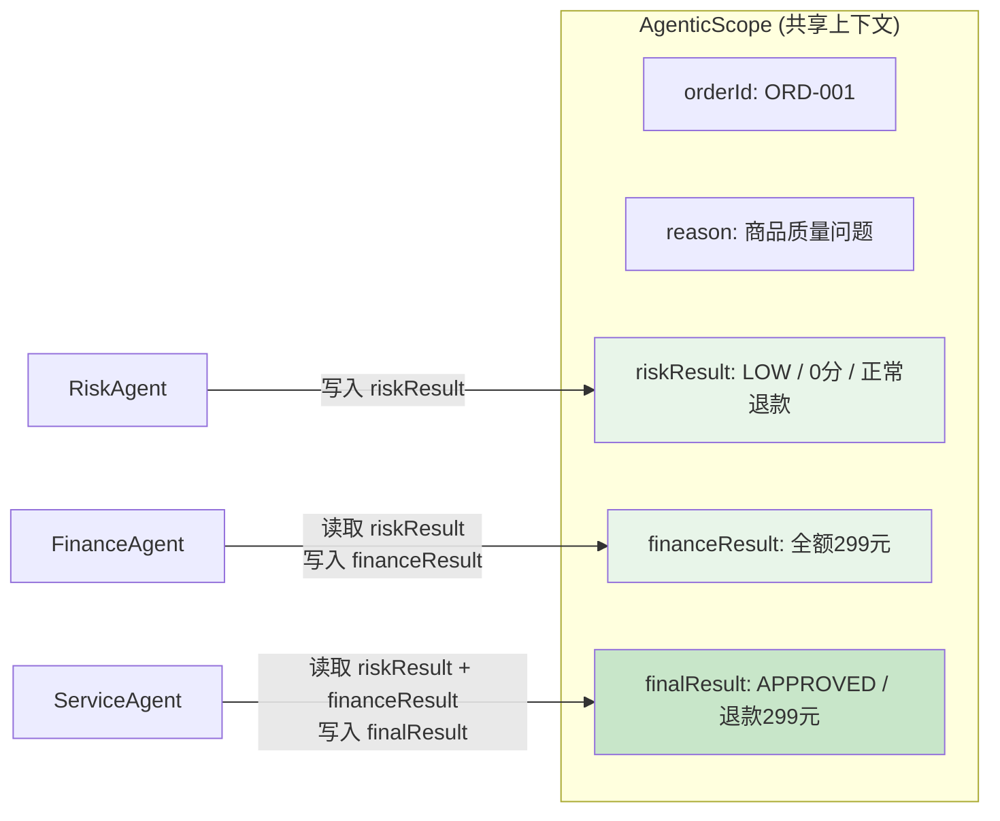
```mermaid
graph LR
    subgraph "AgenticScope (共享上下文)"
        S1["orderId: ORD-001"]
        S2["reason: 商品质量问题"]
        S3["riskResult: LOW / 0分 / 正常退款"]
        S4["financeResult: 全额299元"]
        S5["finalResult: APPROVED / 退款299元"]
    end
    
    A["RiskAgent"] -->|"写入 riskResult"| S3
    B["FinanceAgent"] -->|"读取 riskResult<br/>写入 financeResult"| S4
    C["ServiceAgent"] -->|"读取 riskResult + financeResult<br/>写入 finalResult"| S5
    
    style S3 fill:#e8f5e9
    style S4 fill:#e8f5e9
    style S5 fill:#c8e6c9
```

### 4.5 调用示例

```bash
# 低风险场景：VIP用户 + 质量问题
curl -X POST "http://localhost:8081/api/sequential/refund?orderId=ORD-001&reason=商品质量问题"

# 高风险场景：普通用户 + 频繁退款
curl -X POST "http://localhost:8081/api/sequential/refund?orderId=ORD-003&reason=不喜欢了"
```

---

## 5. 模式二：Parallel — 并行分发

### 5.1 场景描述

> **业务需求：** 退款申请同时核验订单、信用、库存三个维度，互不依赖，并行处理后汇总。

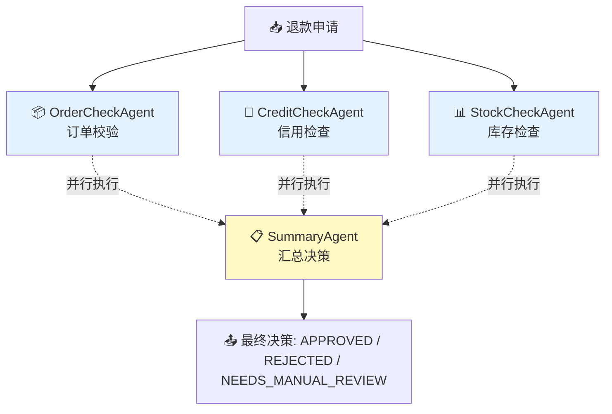
```mermaid
graph TD
    A["📥 退款申请"] 
    A --> B1["📦 OrderCheckAgent<br/>订单校验"]
    A --> B2["🪪 CreditCheckAgent<br/>信用检查"]
    A --> B3["📊 StockCheckAgent<br/>库存检查"]
    
    B1 -.->|"并行执行"| C["📋 SummaryAgent<br/>汇总决策"]
    B2 -.->|"并行执行"| C
    B3 -.->|"并行执行"| C
    
    C --> D["📤 最终决策: APPROVED / REJECTED / NEEDS_MANUAL_REVIEW"]
    
    style B1 fill:#e3f2fd
    style B2 fill:#e3f2fd
    style B3 fill:#e3f2fd
    style C fill:#fff9c4
```

### 5.2 关键特征

- **无数据依赖**：三个检查 Agent 互不依赖，可同时执行
- **缩短延时**：总耗时 ≈ max(各 Agent 耗时)，而非累加
- **汇总收敛**：需要一个汇总 Agent 将所有结果收敛为最终决策

### 5.3 代码实现

核心技巧：**Parallel block + Sequential 串联**

```java
@Service
public class ParallelService {
    private final ParallelCheckWorkflow parallelCheckWorkflow;

    public ParallelService(ChatModel chatModel, AfterSalesTools tools) {
        // 1. 构建三个并行 Agent
        OrderCheckAgent orderCheck = AgenticServices
            .agentBuilder(OrderCheckAgent.class).chatModel(chatModel)
            .tools(tools).outputKey("orderCheckResult").build();

        CreditCheckAgent creditCheck = AgenticServices
            .agentBuilder(CreditCheckAgent.class).chatModel(chatModel)
            .tools(tools).outputKey("creditCheckResult").build();

        StockCheckAgent stockCheck = AgenticServices
            .agentBuilder(StockCheckAgent.class).chatModel(chatModel)
            .tools(tools).outputKey("stockCheckResult").build();

        // 2. 构建并行块 —— 三个 Agent 同时执行
        UntypedAgent parallelBlock = AgenticServices
            .parallelBuilder()
            .subAgents(orderCheck, creditCheck, stockCheck)
            .outputKey("parallelCheckResult")
            .build();
        // ⚠️ 注意：parallelBuilder 返回 UntypedAgent，不是类型化接口

        // 3. 构建汇总 Agent
        SummaryAgent summary = AgenticServices
            .agentBuilder(SummaryAgent.class).chatModel(chatModel)
            .outputKey("summaryResult").build();

        // 4. 串联：并行块 → 汇总
        this.parallelCheckWorkflow = AgenticServices
            .sequenceBuilder(ParallelCheckWorkflow.class)
            .subAgents(parallelBlock, summary)   // ← 先并行、后汇总
            .outputKey("summaryResult")
            .build();
    }
}
```

### 5.4 数据流动图

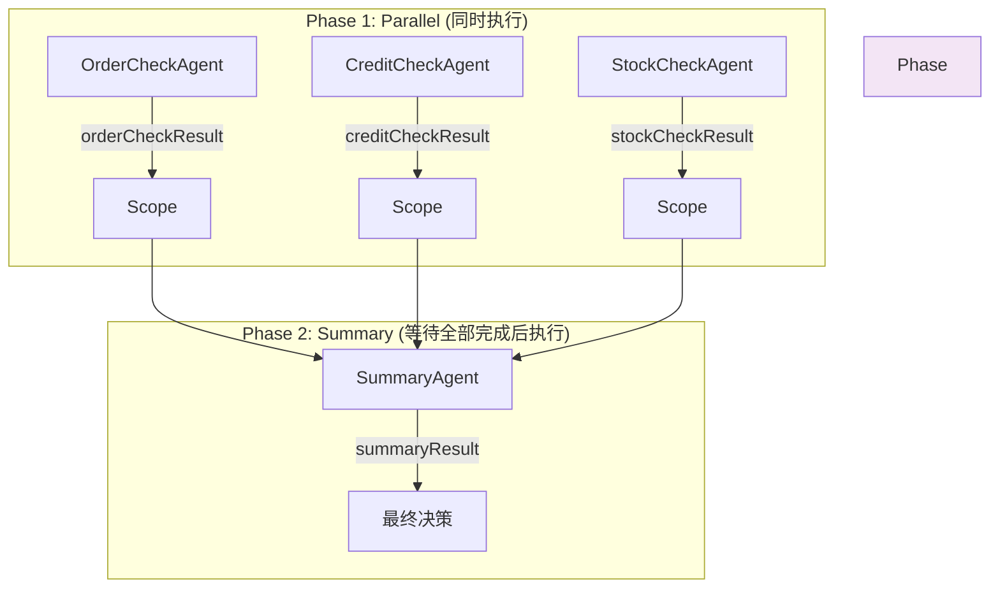
```mermaid
graph TB
    subgraph "Phase 1: Parallel (同时执行)"
        O["OrderCheckAgent"] -->|"orderCheckResult"| P1["Scope"]
        C["CreditCheckAgent"] -->|"creditCheckResult"| P2["Scope"]
        S["StockCheckAgent"] -->|"stockCheckResult"| P3["Scope"]
    end
    
    subgraph "Phase 2: Summary (等待全部完成后执行)"
        P1 --> SA["SummaryAgent"]
        P2 --> SA
        P3 --> SA
        SA -->|"summaryResult"| R["最终决策"]
    end
    
    style Phase fill:#f3e5f5
```

### 5.5 时序对比

| 模式 | 顺序执行（Sequential） | 并行执行（Parallel） |
|------|----------------------|---------------------|
| 耗时 | T₁ + T₂ + T₃ | max(T₁, T₂, T₃) + T₄ |
| 适用 | 有数据依赖的步骤 | 互不依赖的独立检查 |

---

## 6. 模式三：Loop — 迭代优化

### 6.1 场景描述

> **业务需求：** 自动生成售后回复文案，通过"起草→评审"循环迭代，直到评分达到 8 分以上才输出。

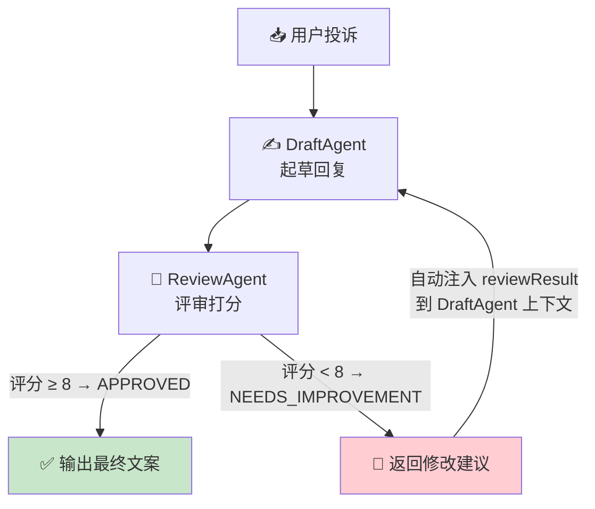
```mermaid
graph TD
    A["📥 用户投诉"] --> B["✍️ DraftAgent<br/>起草回复"]
    B --> C["🔎 ReviewAgent<br/>评审打分"]
    C -->|"评分 ≥ 8 → APPROVED"| D["✅ 输出最终文案"]
    C -->|"评分 < 8 → NEEDS_IMPROVEMENT"| E["📝 返回修改建议"]
    E -->|"自动注入 reviewResult<br/>到 DraftAgent 上下文"| B
    
    style D fill:#c8e6c9
    style E fill:#ffcdd2
```

### 6.2 关键特征

- **质量门控**：通过评分/检查条件自动决定是否重试
- **退出条件**：必须定义 `exitCondition` 和 `maxIterations`
- **上下文注入**：上一轮的输出自动注入到下一轮输入

### 6.3 代理间上下文传递的关键设计

DraftAgent 使用 `summarizedContext` 自动接收上一轮的评审反馈：

```java
// DraftAgent.java — 注意 summarizedContext 参数
public interface DraftAgent {
    @Agent(name = "DraftAgent",
            description = "文案起草Agent",
            outputKey = "draftReply",
            summarizedContext = {"reviewResult"}   // ← 关键！
    )
    String draftReply(@V("orderId") String orderId, @V("reason") String reason);
}
```

**`summarizedContext = {"reviewResult"}`** 的含义：
- 每次循环迭代时，自动将上一轮 ReviewAgent 的 `reviewResult` 注入到 DraftAgent 的上下文
- 首次迭代时 Scope 中没有 `reviewResult`，不会报错，DraftAgent 直接起草
- 后续迭代时，DraftAgent 会收到"上次评审说XXX，请改进"

### 6.4 代码实现

```java
@Service
public class LoopService {
    private final LoopReplyWorkflow loopReplyWorkflow;

    public LoopService(ChatModel chatModel, AfterSalesTools tools) {
        // 1. DraftAgent — 负责起草和修改
        DraftAgent draftAgent = AgenticServices
            .agentBuilder(DraftAgent.class).chatModel(chatModel)
            .tools(tools).outputKey("draftReply").build();

        // 2. ReviewAgent — 负责评审和打分
        ReviewAgent reviewAgent = AgenticServices
            .agentBuilder(ReviewAgent.class).chatModel(chatModel)
            .outputKey("reviewResult").build();

        // 3. 退出条件：reviewResult 包含 "APPROVED"
        Predicate<AgenticScope> exitCondition = scope -> {
            String result = scope.readState("reviewResult", "");
            return result.contains("APPROVED");
        };

        // 4. 组装 Loop 工作流
        this.loopReplyWorkflow = AgenticServices
            .loopBuilder(LoopReplyWorkflow.class)
            .subAgents(draftAgent, reviewAgent)   // ← 循环执行这两个
            .exitCondition(exitCondition)          // ← 何时退出循环
            .maxIterations(3)                      // ← 最多 3 轮（防止死循环）
            .outputKey("reviewResult")
            .build();
    }
}
```

### 6.5 执行流程可视化

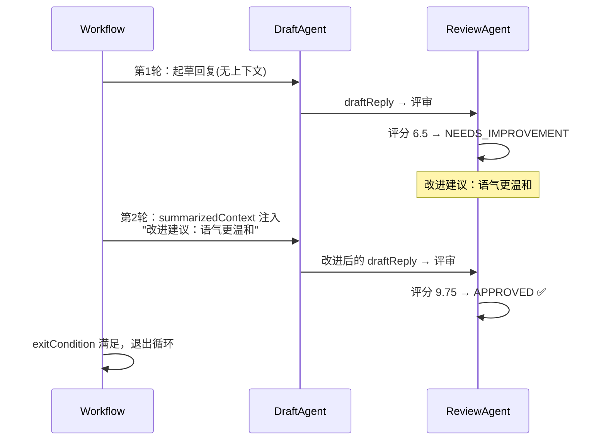
```mermaid
sequenceDiagram
    participant W as Workflow
    participant D as DraftAgent
    participant R as ReviewAgent
    
    W->>D: 第1轮：起草回复(无上下文)
    D->>R: draftReply → 评审
    R->>R: 评分 6.5 → NEEDS_IMPROVEMENT
    Note over R: 改进建议：语气更温和
    
    W->>D: 第2轮：summarizedContext 注入<br/>"改进建议：语气更温和"
    D->>R: 改进后的 draftReply → 评审
    R->>R: 评分 9.75 → APPROVED ✅
    
    W->>W: exitCondition 满足，退出循环
```

---

## 7. 模式四：Conditional — 条件分流

### 7.1 场景描述

> **业务需求：** 根据退款原因自动分类，走不同的处理通道。

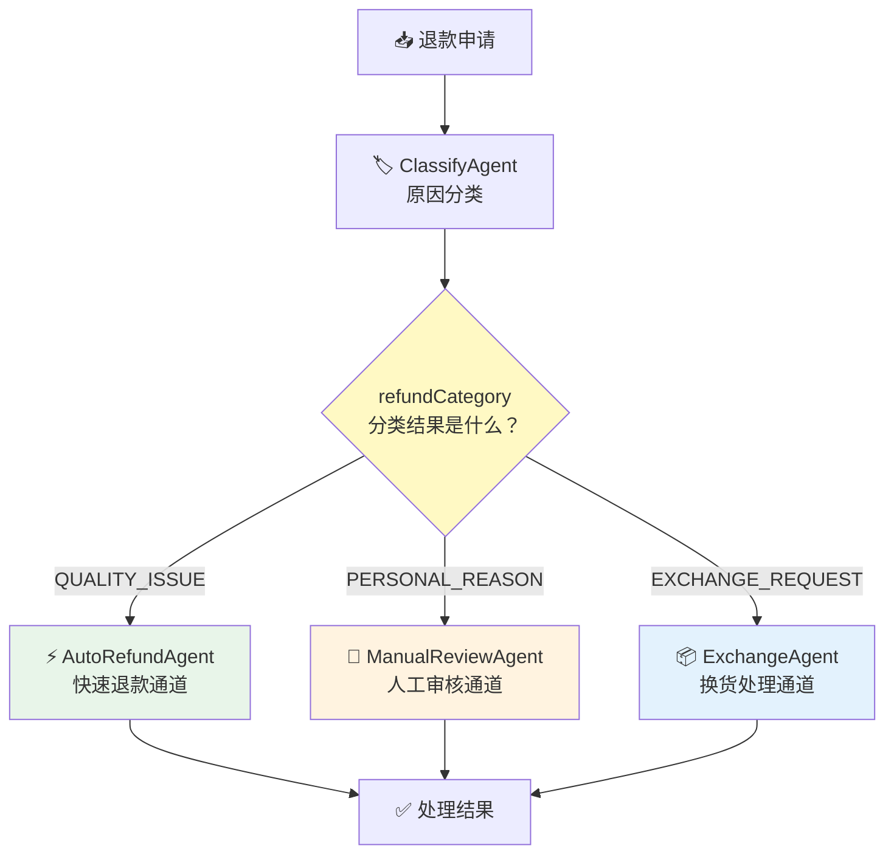
```mermaid
graph TD
    A["📥 退款申请"] --> B["🏷️ ClassifyAgent<br/>原因分类"]
    B --> C{"refundCategory<br/>分类结果是什么？"}
    
    C -->|"QUALITY_ISSUE"| D["⚡ AutoRefundAgent<br/>快速退款通道"]
    C -->|"PERSONAL_REASON"| E["👤 ManualReviewAgent<br/>人工审核通道"]
    C -->|"EXCHANGE_REQUEST"| F["📦 ExchangeAgent<br/>换货处理通道"]
    
    D --> G["✅ 处理结果"]
    E --> G
    F --> G
    
    style C fill:#fff9c4
    style D fill:#e8f5e9
    style E fill:#fff3e0
    style F fill:#e3f2fd
```

### 7.2 关键特征

- **分支路由**：类似编程中的 `if-else` 或 `switch`
- **Predicate 判断**：用 Java `Predicate<AgenticScope>` 做条件判断
- **精确匹配**：多个分支时按注册顺序匹配，命中第一个即停止

### 7.3 代码实现

```java
@Service
public class ConditionalService {
    private final ConditionalRefundWorkflow conditionalRefundWorkflow;

    public ConditionalService(ChatModel chatModel, AfterSalesTools tools) {
        // 1. 分类 Agent
        ClassifyAgent classifyAgent = AgenticServices
            .agentBuilder(ClassifyAgent.class).chatModel(chatModel)
            .tools(tools).outputKey("refundCategory")   // ← 存入分类结果
            .build();

        // 2. 三个通道 Agent
        AutoRefundAgent autoRefund = AgenticServices
            .agentBuilder(AutoRefundAgent.class).chatModel(chatModel)
            .tools(tools).outputKey("processResult").build();

        ManualReviewAgent manualReview = AgenticServices
            .agentBuilder(ManualReviewAgent.class).chatModel(chatModel)
            .tools(tools).outputKey("processResult").build();

        ExchangeAgent exchange = AgenticServices
            .agentBuilder(ExchangeAgent.class).chatModel(chatModel)
            .tools(tools).outputKey("processResult").build();

        // 3. 条件谓词：读取 ClassifyAgent 的输出做判断
        Predicate<AgenticScope> isQuality = s ->
            s.readState("refundCategory", "").contains("QUALITY_ISSUE");
        Predicate<AgenticScope> isPersonal = s ->
            s.readState("refundCategory", "").contains("PERSONAL_REASON");
        Predicate<AgenticScope> isExchange = s ->
            s.readState("refundCategory", "").contains("EXCHANGE_REQUEST");

        // 4. 构建条件路由块
        UntypedAgent conditionalBlock = AgenticServices
            .conditionalBuilder()
            .subAgents(isQuality, autoRefund)      // if quality → auto refund
            .subAgents(isPersonal, manualReview)   // else if personal → manual
            .subAgents(isExchange, exchange)       // else if exchange → exchange
            .outputKey("processResult")
            .build();

        // 5. 串联：分类 → 条件路由
        this.conditionalRefundWorkflow = AgenticServices
            .sequenceBuilder(ConditionalRefundWorkflow.class)
            .subAgents(classifyAgent, conditionalBlock)
            .outputKey("processResult")
            .build();
    }
}
```

### 7.4 条件匹配规则

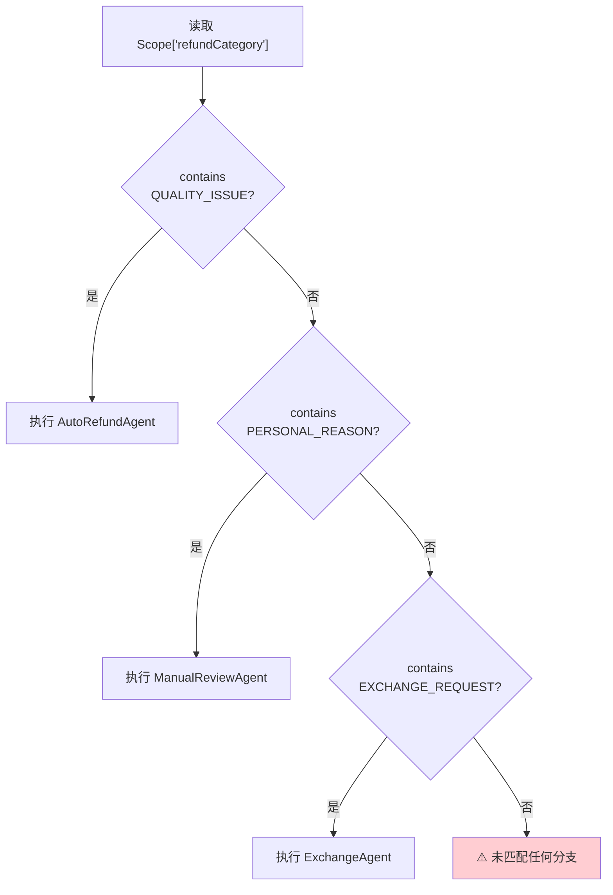
```mermaid
graph TD
    A["读取 Scope['refundCategory']"] --> B{"contains<br/>QUALITY_ISSUE?"}
    B -->|"是"| C["执行 AutoRefundAgent"]
    B -->|"否"| D{"contains<br/>PERSONAL_REASON?"}
    D -->|"是"| E["执行 ManualReviewAgent"]
    D -->|"否"| F{"contains<br/>EXCHANGE_REQUEST?"}
    F -->|"是"| G["执行 ExchangeAgent"]
    F -->|"否"| H["⚠️ 未匹配任何分支"]
    
    style H fill:#ffcdd2
```

> ⚠️ **注意**：建议确保所有可能的分支都有 Predicate 覆盖，否则工作流会无法执行任何分支。

---

## 8. 模式五：Supervisor — 主管调度

### 8.1 场景描述

> **业务需求：** 面对复杂售后诉求（投诉 + 赔偿 + 情绪激烈），由 Supervisor Agent 自主编排子 Agent 的执行计划。

这与前四种模式最大的区别在于：**流程不是预先写死的，而是由 LLM 在运行时动态决定的**。

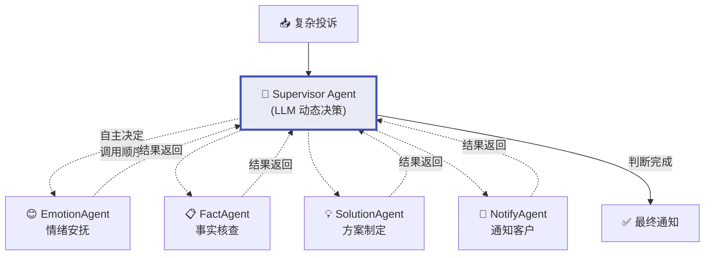
```mermaid
graph TD
    A["📥 复杂投诉"] --> B["🧠 Supervisor Agent<br/>(LLM 动态决策)"]
    
    B -.->|"自主决定<br/>调用顺序"| C["😊 EmotionAgent<br/>情绪安抚"]
    B -.-> D["📋 FactAgent<br/>事实核查"]
    B -.-> E["💡 SolutionAgent<br/>方案制定"]
    B -.-> F["📧 NotifyAgent<br/>通知客户"]
    
    C -.->|"结果返回"| B
    D -.->|"结果返回"| B
    E -.->|"结果返回"| B
    F -.->|"结果返回"| B
    
    B -->|"判断完成"| G["✅ 最终通知"]
    
    style B fill:#e8eaf6,stroke:#3f51b5,stroke-width:3px
```

### 8.2 关键特征

- **完全动态**：不预设执行顺序，由 Supervisor 根据输入自主决策
- **LLM 驱动的决策中枢**：Supervisor 本身也是 LLM，它理解任务并规划步骤
- **可重复调用**：可以多次调用同一个子 Agent（比如先安抚情绪，调查后发现没解决，再安抚）
- **需要限制**：必须有 `maxAgentsInvocations()` 防止无限循环

### 8.3 Supervisor 上下文设计

Supervisor 的"智慧"来自 `supervisorContext` 中的 Prompt：

```java
@Service
public class SupervisorService {
    private final SupervisorWorkflow supervisorWorkflow;

    public SupervisorService(ChatModel chatModel, AfterSalesTools tools) {
        // 1. 构建四个子 Agent（和前面一样的方式）
        EmotionAgent emotionAgent = AgenticServices
            .agentBuilder(EmotionAgent.class).chatModel(chatModel)
            .tools(tools).outputKey("emotionResult").build();
        
        FactAgent factAgent = AgenticServices
            .agentBuilder(FactAgent.class).chatModel(chatModel)
            .tools(tools).outputKey("factResult").build();
        
        SolutionAgent solutionAgent = AgenticServices
            .agentBuilder(SolutionAgent.class).chatModel(chatModel)
            .outputKey("solutionResult").build();
        
        NotifyAgent notifyAgent = AgenticServices
            .agentBuilder(NotifyAgent.class).chatModel(chatModel)
            .outputKey("notifyResult").build();

        // 2. 🔑 核心：Supervisor 的上下文提示词
        String supervisorContext = """
            你是电商售后主管，负责协调处理复杂的用户投诉。
            
            你可以调度以下子 Agent：
            1. EmotionAgent - 情绪安抚：分析用户情绪，生成安抚话术
            2. FactAgent - 事实调查：查询订单和用户信息，梳理事实
            3. SolutionAgent - 方案制定：综合情绪和事实，制定处理方案
            4. NotifyAgent - 通知执行：生成客户通知文案并执行
            
            请根据用户投诉内容，自主决定：
            - 需要调用哪些子 Agent
            - 调用顺序
            - 是否需要重复调用某个 Agent
            - 何时完成处理
            
            通常的处理流程是：情绪安抚 → 事实调查 → 方案制定 → 通知执行，
            但你可以根据具体情况灵活调整。
            """;

        // 3. 请求生成器：从方法参数构建 Supervisor 的输入
        Function<AgenticScope, String> requestGenerator = scope -> {
            String orderId = scope.readState("orderId", "");
            String complaint = scope.readState("complaint", "");
            return "请处理以下售后投诉：\n订单ID: " + orderId + "\n用户投诉: " + complaint;
        };

        // 4. 输出提取器：从 Scope 中提取最终结果
        Function<AgenticScope, Object> outputExtractor = scope -> {
            String notifyResult = scope.readState("notifyResult", "");
            if (!notifyResult.isEmpty()) return notifyResult;
            return scope.readState("solutionResult", "处理未完成");
        };

        // 5. 构建 Supervisor 工作流
        this.supervisorWorkflow = AgenticServices
            .supervisorBuilder(SupervisorWorkflow.class)
            .chatModel(chatModel)
            .name("AfterSalesSupervisor")
            .description("电商售后主管，动态调度子Agent处理复杂投诉")
            .supervisorContext(supervisorContext)       // ← 告诉 Supervisor 有哪些兵
            .requestGenerator(requestGenerator)          // ← 如何构建初始请求
            .subAgents(emotionAgent, factAgent, solutionAgent, notifyAgent)
            .maxAgentsInvocations(8)                     // ← 最多调用 8 次子 Agent
            .output(outputExtractor)                     // ← 如何提取最终结果
            .outputKey("finalResult")
            .build();
    }
}
```

### 8.4 Supervisor vs Sequential 对比

| 维度 | Sequential（顺序） | Supervisor（主管） |
|------|-------------------|-------------------|
| 流程 | **编译时确定** | **运行时动态** |
| 灵活性 | 低（固定路由） | 高（自主决策） |
| 可预测性 | 高（每次都一样） | 低（每次可能不同） |
| 可控性 | 强（开发者决定） | 弱（依赖 LLM 判断力） |
| 适用 | 标准化流程 | 复杂多变场景 |
| 成本 | 低（确定 LLM 调用次数） | 较高（可能多轮调度） |

---

## 9. 模式六：HumanInTheLoop — 人工介入

> 本章采用 LangChain4j 官方默认机制实现：用 `@HumanInTheLoop` 注解标记审批方法，配合 `PendingResponse` 完成状态的保存与恢复，并演示「进程重启后按业务 ID 恢复中断的审批」。

### 9.1 场景描述

> **业务需求：** 大额退款需人工审批。工作流完成前置检查后自动暂停，等待主管审批后恢复执行；
> 若应用在审批等待期间重启，重启后能按业务 ID 反序列化 `PendingResponse` 并完成中断的审批。

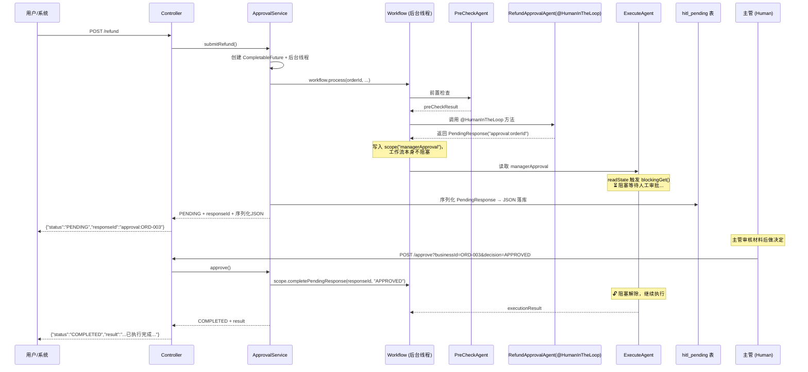
```mermaid
sequenceDiagram
    participant U as 用户/系统
    participant C as Controller
    participant S as ApprovalService
    participant W as Workflow (后台线程)
    participant P as PreCheckAgent
    participant A as RefundApprovalAgent(@HumanInTheLoop)
    participant E as ExecuteAgent
    participant DB as hitl_pending 表
    participant M as 主管 (Human)

    U->>C: POST /refund
    C->>S: submitRefund()
    S->>S: 创建 CompletableFuture + 后台线程
    S->>W: workflow.process(orderId, ...)

    W->>P: 前置检查
    P-->>W: preCheckResult

    W->>A: 调用 @HumanInTheLoop 方法
    A-->>W: 返回 PendingResponse("approval:orderId")
    Note over W: 写入 scope("managerApproval")，<br/>工作流本身不阻塞

    W->>E: 读取 managerApproval
    Note over E: readState 触发 blockingGet()<br/>⏳ 阻塞等待人工审批...

    S->>DB: 序列化 PendingResponse → JSON 落库
    S-->>C: PENDING + responseId + 序列化JSON
    C-->>U: {"status":"PENDING","responseId":"approval:ORD-003"}

    Note over M: 主管审核材料后做决定
    M->>C: POST /approve?businessId=ORD-003&decision=APPROVED
    C->>S: approve()
    S->>W: scope.completePendingResponse(responseId, "APPROVED")

    Note over E: 🔓 阻塞解除，继续执行
    E-->>W: executionResult
    S-->>C: COMPLETED + result
    C-->>U: {"status":"COMPLETED","result":"...已执行完成..."}
```

### 9.2 关键特征

- **注解驱动**：审批方法用 `@HumanInTheLoop` 注解标记，返回 `PendingResponse`；无需手写 `humanInTheLoopBuilder()`
- **阻塞语义**：工作流线程在下游读取 `PendingResponse` 时经 `blockingGet()` 阻塞，实现「暂停 → 等待人工 → 恢复」
- **可序列化**：`PendingResponse` 经 Jackson 序列化只保留 `responseId`，`CompletableFuture` 被标为 `@JsonIgnore`，反序列化时重建 —— 这是跨进程恢复的基础
- **按业务 ID 恢复**：审批状态序列化落库 `hitl_pending` 表，进程重启后内存会话丢失，但可按 `businessId` 反序列化恢复并完成中断的审批
- **MemoryId 绑定**：`@MemoryId` 将业务 ID 绑定到唯一 `AgenticScope`，使外部能定位会话并注入审批结果

### 9.3 核心机制：@HumanInTheLoop 注解与 PendingResponse

在动手前，先厘清 LangChain4j（1.16.0-beta26）的两个关键对象，它们是本章全部行为的基础。

**(1) `@HumanInTheLoop` 注解**（`dev.langchain4j.agentic.declarative.HumanInTheLoop`）

标注在某个 **静态方法** 上，该方法即被框架识别为一个「人工介入」Agent。被 `AgenticServices.sequenceBuilder(...).subAgents(该类.class, ...)` 装配时，框架经由 `createHumanInTheLoopAgent` 把该方法的返回值作为 `PendingResponse` 写入 AgenticScope 的 `outputKey`。该节点本身不需要 chatModel（它是人工门禁，不是 LLM 推理），可与同工作流中的 LLM Agent 共存。

```java
public interface RefundApprovalAgent {
    @HumanInTheLoop(description = "暂停工作流，等待人工审批", outputKey = "managerApproval")
    static PendingResponse<String> requestApproval(@V("orderId") String orderId,
                                                    @V("amount") double amount) {
        return new PendingResponse<>("approval:" + orderId);   // ← responseId 与业务ID绑定
    }
}
```

**(2) `PendingResponse`**（`dev.langchain4j.agentic.internal.PendingResponse`）

一个「可被外部完成」的延迟响应，内部持有一个 `CompletableFuture`：

| 方法 | 作用 |
|---|---|
| `new PendingResponse<>(responseId)` | 创建一个未完成的响应，`responseId` 是后续定位/完成的关联键 |
| `blockingGet()` | 阻塞直到被 `complete`（内部即 `future.join()`） |
| `complete(value)` | 注入结果，释放所有阻塞在 `blockingGet()` 的线程 |
| `responseId()` | 返回关联键 |

**序列化语义（重点）**：`PendingResponse` 用 Jackson 注解标记 —— 构造器是 `@JsonCreator`，`CompletableFuture` 字段是 `@JsonIgnore`。因此：

- 序列化后只保留 `{"responseId":"approval:ORD-003"}`；
- 反序列化时会用 `responseId` 重建一个 **新的、未完成的** `CompletableFuture`，使外部系统可「重新连接」并完成它。

> 这正是「进程重启后恢复」的语义基础：重启后原阻塞线程已消失，但 `responseId` 被持久化；重启后反序列化得到 `responseId`，重跑工作流到暂停点，用该 `responseId` 完成审批即可。

### 9.4 代码实现

> 包路径：`com.example.agentic.humanintheloop`。完整源码见仓库，下面按 6 步讲解。

#### Step 1：定义三个 Agent（LLM Agent + @HumanInTheLoop 注解）

前置检查与执行用 LLM Agent（AiServices 接口，`@UserMessage` + `@V` 绑定输入）；审批节点用 `@HumanInTheLoop` 注解。三者通过 `outputKey` 串联数据流：`preCheckResult` → `managerApproval` → `executionResult`。

```java
// 前置检查：LLM Agent，产出写入 preCheckResult
public interface PreCheckAgent {
    @UserMessage("""
        你是电商售后前置审核专员……请先调用工具查询订单与用户信息，输出审批材料与初审建议。
        订单ID: {{orderId}}  退款原因: {{reason}}  金额: {{amount}} 元
        """)
    @Agent(name = "PreCheckAgent", description = "退款前置检查，准备审批材料",
           outputKey = "preCheckResult")
    String preCheck(@V("orderId") String orderId,
                    @V("reason") String reason,
                    @V("amount") double amount);
}

// 人工审批：@HumanInTheLoop 注解，返回 PendingResponse
public interface RefundApprovalAgent {
    @HumanInTheLoop(description = "暂停工作流，等待人工审批", outputKey = "managerApproval")
    static PendingResponse<String> requestApproval(@V("orderId") String orderId,
                                                    @V("amount") double amount) {
        return new PendingResponse<>("approval:" + orderId);
    }
}

// 执行：LLM Agent，读取 managerApproval 时会阻塞，直到审批完成
public interface ExecuteAgent {
    @UserMessage("""
        你是售后执行专员……根据主管审批结论执行退款并生成客户通知。
        订单ID: {{orderId}}  前置材料: {{preCheckResult}}  审批结论: {{managerApproval}}
        """)
    @Agent(name = "ExecuteAgent", description = "依据审批结论执行退款",
           outputKey = "executionResult")
    String execute(@V("orderId") String orderId,
                   @V("preCheckResult") String preCheckResult,
                   @V("managerApproval") String managerApproval);
}
```

#### Step 2：定义工作流接口并组装

`@MemoryId` 绑定会话；为简化「按业务 ID 恢复」，这里直接用 `orderId` 作为 memoryId。

```java
public interface RefundWorkflow {
    String process(@MemoryId String requestId,      // ← 同时作为 scope 的 memoryId，取 orderId
                   @V("orderId") String orderId,
                   @V("reason") String reason,
                   @V("amount") double amount);
}
```

组装时 `subAgents` 混用「已构建的 LLM Agent 实例」与「`@HumanInTheLoop` 注解类」：前者是 `agentBuilder(...).chatModel(...).build()` 产出的代理，后者由 `createBuiltInAgentExecutor` 识别注解装配（审批节点自身不需要 chatModel）。

同时注册一个 `AgentListener`（`inheritedBySubagents=true`，会透传到各子 agent）：当 `@HumanInTheLoop` 产出 `PendingResponse` 时，在工作流线程上把 `AgenticScope` 投递给等待中的 `pauseSignal`，**取代调用方的忙等轮询**。

```java
PreCheckAgent preCheckAgent = AgenticServices.agentBuilder(PreCheckAgent.class)
        .chatModel(chatModel).tools(tools).outputKey("preCheckResult").build();
ExecuteAgent executeAgent = AgenticServices.agentBuilder(ExecuteAgent.class)
        .chatModel(chatModel).tools(tools).outputKey("executionResult").build();

this.workflow = AgenticServices.sequenceBuilder(RefundWorkflow.class)
        .listener(new AgentListener() {
            @Override public boolean inheritedBySubagents() { return true; }
            @Override
            public void afterAgentInvocation(AgentResponse resp) {
                // HITL agent 的 output 就是 PendingResponse —— 暂停点已到达
                if (resp.output() instanceof PendingResponse<?> pr) {
                    onApprovalPaused(pr, resp.agenticScope());
                }
            }
        })
        .subAgents(preCheckAgent, RefundApprovalAgent.class, executeAgent)
        .outputKey("executionResult")
        .build();
```

#### Step 3：ApprovalService —— 创建 CompletableFuture + 事件驱动等待暂停

`submitRefund` 创建两个 future：`future`（工作流最终结果）与 `pauseSignal`（到达暂停点的信号）。工作流丢到后台线程，会在 `ExecuteAgent` 读取 `managerApproval` 时阻塞（`blockingGet()`）。调用方不再忙等轮询，而是 `pauseSignal.get(timeout)`——当 `@HumanInTheLoop` 产出 `PendingResponse` 时，Step 2 注册的 listener 会在工作流线程上把 `AgenticScope` 投递过来。

```java
public ApprovalResponse submitRefund(String orderId, String reason, double amount) {
    CompletableFuture<String> future = new CompletableFuture<>();
    running.put(orderId, future);
    CompletableFuture<AgenticScope> pauseSignal = new CompletableFuture<>();
    pauseSignals.put(orderId, pauseSignal);

    // 后台线程运行工作流：在 ExecuteAgent 读取 managerApproval 时阻塞
    workflowExecutor.submit(() -> {
        try {
            future.complete(workflow.process(orderId, orderId, reason, amount));
        } catch (Throwable t) {
            future.completeExceptionally(t);
            pauseSignal.completeExceptionally(t);   // 失败也要解除调用方等待，避免等满超时
        }
    });

    // 事件驱动等待到达暂停点：listener 投递 scope，无需轮询
    AgenticScope scope = pauseSignal.get(PAUSE_TIMEOUT_MS, TimeUnit.MILLISECONDS);
    // ...见 Step 4：取出 PendingResponse 序列化落库
}
```

> **为什么不用 `while + Thread.sleep` 轮询？** 忙等会把 HTTP 线程挂在 precheck LLM 调用的整段时间上，还每 100ms 醒一次空转；高并发时每个在途审批都占一个线程在空转。事件驱动后，调用方线程在 `get()` 上真正挂起（OS 级阻塞，零 CPU），暂停一发生就被 listener 唤醒。

#### Step 4：序列化 PendingResponse 落库

到达暂停点后，从 `scope.state().get("managerApproval")` 取出 **真实的 `PendingResponse`**，用 Jackson 序列化为 JSON 落库。`scope.state()` 返回原始 Map（不会阻塞），而 `readState()` 对延迟响应才会阻塞。

```java
// scope 来自 Step 3 的 pauseSignal.get(...)（listener 已投递）

// 取出真实 PendingResponse 并序列化
Object stored = scope.state().get(APPROVAL_OUTPUT_KEY);   // "managerApproval"
PendingResponse<?> pending = (stored instanceof PendingResponse<?> p)
        ? p
        : new PendingResponse<>(responseId(orderId));
String serialized = serialize(pending);   // → {"responseId":"approval:ORD-003"}

// 落库（hitl_pending 表，主键 businessId = orderId）
HitlPendingEntity entity = HitlPendingEntity.builder()
        .businessId(orderId).orderId(orderId).reason(reason).amount(amount)
        .responseId(pending.responseId())
        .serializedPending(serialized)
        .status(ApprovalStatus.PENDING.code())
        .precheckResult(readQuietly(scope, "preCheckResult"))
        .build();
saveOrUpdate(entity);

return ApprovalResponse.from(entity, entity.getPrecheckResult(), "已暂停等待人工审批");
```

序列化/反序列化的实现（日志会打印全过程，是演示重点）：

```java
public String serialize(PendingResponse<?> pending) {
    String json = objectMapper.writeValueAsString(pending);
    log.info("[serialize] responseId={} → json={}", pending.responseId(), json);
    return json;
}

public PendingResponse<?> deserialize(String json) {
    PendingResponse<?> pr = objectMapper.readValue(json, PendingResponse.class);
    log.info("[deserialize] json={} → responseId={} (新 CompletableFuture 已重建, isDone={})",
            json, pr.responseId(), pr.isDone());
    return pr;
}
```

#### Step 5：人工审批 —— completePendingResponse 恢复工作流

`approve` 通过 `AgenticScopeAccess` 定位会话，调用 `completePendingResponse(responseId, value)` 注入审批结论，解除 `ExecuteAgent` 的阻塞，然后阻塞等待最终结果。

```java
public ApprovalResponse approve(String orderId, String decision, String comment) {
    CompletableFuture<String> future = running.get(orderId);
    AgenticScope scope = ((AgenticScopeAccess) workflow).getAgenticScope(orderId);
    if (future == null || scope == null) {
        return ApprovalResponse.notFound(orderId,
                "内存中无运行中的会话（可能进程已重启），请改用 POST /recover 恢复");
    }

    String approvalText = decision + (isBlank(comment) ? "" : " - " + comment);
    // 🔓 用 responseId 完成 PendingResponse，解除阻塞
    scope.completePendingResponse(responseId(orderId), approvalText);

    // 阻塞等待工作流恢复执行并产出最终结果
    String result = future.get(RESULT_TIMEOUT_S, TimeUnit.SECONDS);

    running.remove(orderId);
    ((AgenticScopeAccess) workflow).evictAgenticScope(orderId);
    markStatus(orderId, isApproved(decision) ? COMPLETED : REJECTED, decision, result);
    return ApprovalResponse.from(pendingMapper.selectById(orderId), null, "审批已完成");
}
```

> `responseId(orderId)` 即 `"approval:" + orderId`，与 `RefundApprovalAgent` 中构造的一致。`completePendingResponse` 在 scope 内部按 `responseId` 匹配到对应的 `PendingResponse` 并 `complete`。

#### Step 6：重启恢复 —— 反序列化 PendingResponse 并完成中断的审批

进程重启后，内存中的 `AgenticScope` 与阻塞线程都已丢失，但 `hitl_pending` 表里的序列化 JSON 仍在。`RecoveryController.recover` 反序列化取得 `responseId`，重跑工作流到暂停点，用该 `responseId` 完成审批。

```java
public ApprovalResponse recover(String orderId, String decision, String comment) {
    HitlPendingEntity entity = pendingMapper.selectById(orderId);
    if (entity == null) return ApprovalResponse.notFound(orderId, "未找到待恢复记录");

    // ★ 反序列化：从 DB 的 JSON 还原 PendingResponse，取得 responseId
    PendingResponse<?> restored = deserialize(entity.getSerializedPending());
    log.info("recover: deserialized responseId={}", restored.responseId());

    // 重启后内存 scope 已丢失：重跑工作流，同样用 pauseSignal 事件等待到达暂停点
    CompletableFuture<String> future = new CompletableFuture<>();
    running.put(orderId, future);
    CompletableFuture<AgenticScope> pauseSignal = new CompletableFuture<>();
    pauseSignals.put(orderId, pauseSignal);
    workflowExecutor.submit(() -> {
        try {
            future.complete(workflow.process(orderId, orderId, entity.getReason(), entity.getAmount()));
        } catch (Throwable t) {
            future.completeExceptionally(t);
            pauseSignal.completeExceptionally(t);
        }
    });

    AgenticScope scope = pauseSignal.get(PAUSE_TIMEOUT_MS, TimeUnit.MILLISECONDS);
    // 用反序列化得到的 responseId 完成中断的审批
    scope.completePendingResponse(restored.responseId(), decision);

    String result = future.get(RESULT_TIMEOUT_S, TimeUnit.SECONDS);
    markStatus(orderId, isApproved(decision) ? RECOVERED : REJECTED, decision, result);
    return ApprovalResponse.from(pendingMapper.selectById(orderId), null, "已通过重启恢复完成");
}
```

`RecoveryController` 还提供 `simulate-restart`（清除内存会话、保留 DB 记录，用于演示）与 `recover/pending`（列出中断记录）两个端点。

### 9.5 演示流程

**流程 A：正常审批（不重启）**

```bash
# 1) 提交退款，工作流暂停，PendingResponse 序列化落库
curl -X POST "http://localhost:8080/api/humanintheloop/refund?orderId=ORD-003&reason=不喜欢了&amount=918"
# → {"status":"PENDING","responseId":"approval:ORD-003","serializedPending":"{\"responseId\":\"approval:ORD-003\"}",...}

# 2) 人工审批，恢复工作流并阻塞等待结果
curl -X POST "http://localhost:8080/api/humanintheloop/approve?businessId=ORD-003&decision=APPROVED"
# → {"status":"COMPLETED","result":"订单 ORD-003 退款 ¥918.00 已执行完成..."}
```

**流程 B：模拟进程重启后恢复**

```bash
# 1) 提交退款（暂停、落库）
curl -X POST "http://localhost:8080/api/humanintheloop/refund?orderId=ORD-004&reason=质量问题&amount=1200"

# 2) 模拟进程重启：清除内存会话，DB 记录保留
curl -X POST "http://localhost:8080/api/humanintheloop/simulate-restart?businessId=ORD-004"

# 3) 查看待恢复记录
curl "http://localhost:8080/api/humanintheloop/recover/pending"

# 4) 恢复并完成中断的审批（日志会打印反序列化过程）
curl -X POST "http://localhost:8080/api/humanintheloop/recover?businessId=ORD-004&decision=APPROVED"
# → {"status":"RECOVERED","result":"订单 ORD-004 退款 ¥1200.00 已执行完成..."}
```

恢复时日志会输出：

```
[deserialize] json={"responseId":"approval:ORD-004"} → responseId=approval:ORD-004 (新 CompletableFuture 已重建, isDone=false)
recover: deserialized responseId=approval:ORD-004
```

### 9.6 HumanInTheLoop 的执行时序


```mermaid
gantt
    title HumanInTheLoop 工作流执行时序（正常流程）
    dateFormat HH:mm:ss
    axisFormat %M:%S

    section 主线程
    提交申请 submitRefund       :active, t1, 00:00:00, 00:00:01
    事件等待暂停点              :t2, 00:00:01, 00:00:02
    序列化 PendingResponse 落库 :t3, 00:00:02, 00:00:03
    返回 PENDING                :crit, t4, 00:00:03, 00:00:04
    等待人工决策 (任意时长)     :t5, 00:00:04, 00:02:00
    审批调用 approve            :active, t6, 00:02:00, 00:02:01
    completePendingResponse     :t7, 00:02:01, 00:02:01
    阻塞等待工作流完成          :t8, 00:02:01, 00:02:02
    返回 COMPLETED              :crit, t9, 00:02:02, 00:02:03

    section 后台工作流线程
    PreCheckAgent               :active, w1, 00:00:01, 00:00:04
    RefundApprovalAgent 返回    :w2, 00:00:04, 00:00:05
    ExecuteAgent 阻塞           :crit, w3, 00:00:05, 00:02:01
    ExecuteAgent 恢复           :active, w4, 00:02:01, 00:02:02
    工作流完成                  :done, w5, 00:02:02, 00:02:02
```

> **重启恢复流程**：`simulate-restart` 清除内存会话 → `recover` 反序列化 `PendingResponse` 取得 `responseId` → 重跑工作流到暂停点 → `completePendingResponse(responseId, decision)` 完成 → `status=RECOVERED`。时序上与上图「后台工作流线程」段一致，区别仅在于暂停点之前的会话是重启后重建的。

---

## 10. 模式对比与选型指南

### 10.1 六种模式总览

| 模式 | Builder | 拓扑结构 | 决策方式 | LLM调用量 | 适用场景 |
|------|---------|----------|----------|-----------|----------|
| **Sequential** | `sequenceBuilder` | 线形 A→B→C | 编译时固定 | 确定（每个Agent一次） | 审批流、ETL管道 |
| **Parallel** | `parallelBuilder` | 扇形汇合 | 编译时固定 | 确定 | 独立检查、多维度评估 |
| **Loop** | `loopBuilder` | 循环 A⇄B | 运行时 exitCondition | 变量（多轮） | 内容生成+质量门控 |
| **Conditional** | `conditionalBuilder` | 树形分支 | 运行时 Predicate | 确定（但路径可变） | 分类路由、多通道处理 |
| **Supervisor** | `supervisorBuilder` | LLM动态 | LLM自主决策 | 不确定 | 复杂多变场景 |
| **HumanInTheLoop** | `@HumanInTheLoop` 注解 | 暂停点注入 | 外部人工输入 | 确定+暂停 | 需要审批的业务流程 |

### 10.2 选型决策树

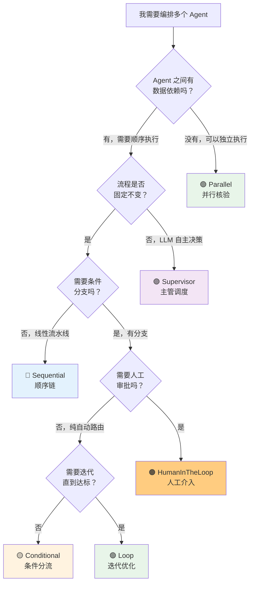
```mermaid
graph TD
    A["我需要编排多个 Agent"] --> B{"Agent 之间有<br/>数据依赖吗？"}
    
    B -->|"有，需要顺序执行"| C{"流程是否<br/>固定不变？"}
    B -->|"没有，可以独立执行"| D["🟢 Parallel<br/>并行核验"]
    
    C -->|"是"| E{"需要条件<br/>分支吗？"}
    C -->|"否，LLM 自主决策"| F["🟣 Supervisor<br/>主管调度"]
    
    E -->|"否，线性流水线"| G["🔵 Sequential<br/>顺序链"]
    E -->|"是，有分支"| H{"需要人工<br/>审批吗？"}
    
    H -->|"否，纯自动路由"| I{"需要迭代<br/>直到达标？"}
    H -->|"是"| J["🟠 HumanInTheLoop<br/>人工介入"]
    
    I -->|"否"| K["🟡 Conditional<br/>条件分流"]
    I -->|"是"| L["🟢 Loop<br/>迭代优化"]
    
    style G fill:#e3f2fd
    style D fill:#e8f5e9
    style L fill:#e8f5e9
    style K fill:#fff3e0
    style F fill:#f3e5f5
    style J fill:#ffcc80
```

### 10.3 组合使用

真实场景中，多种模式往往组合使用。例如本项目中的 **Parallel + Sequential**：

```
ParallelBlock (OrderCheck + CreditCheck + StockCheck)  →  SummaryAgent
       ↑ parallelBuilder                                      ↑ sequenceBuilder
```

你也可以想象 **Conditional + Loop + HumanInTheLoop** 的组合：

```
ClassifyAgent → 条件分流:
  ├─ 质量问题 → Loop(Draft → Review 直到达标) → 自动发送
  └─ 大额退款 → HumanInTheLoop (前置检查 → 暂停 → 主管审批 → 执行)
```

---

## 11. 最佳实践与踩坑经验

### 11.1 Prompt 设计原则

1. **明确角色和边界**：每个 Agent 的 `@UserMessage` 要清晰定义"你是谁、做什么、输出什么格式"

2. **结构化输出**：要求 Agent 输出格式化文本（如 `风险等级: [HIGH/MEDIUM/LOW]`），方便下游解析和条件判断

3. **指示工具调用时机**：在 Prompt 中明确告知"请先调用工具查询XXX信息，然后..."

4. **提供业务规则**：把决策规则写在 Prompt 里，而不是靠训练数据

```java
// ✅ 好的 Prompt 示例
@UserMessage("""
    你是风控专员。
    请先调用工具查询订单和用户信息，然后根据以下规则评估：
    1. 高风险：历史退款≥3次 且 订单>500元
    2. 低风险：首次退款 或 VIP用户
    
    返回格式（严格遵循）：
    风险等级: [HIGH/MEDIUM/LOW]
    风险评分: [0-100]
    """)

// ❌ 不好的 Prompt — 太模糊
@UserMessage("请帮我看一下这个退款有没有风险")
```

### 11.2 Agent 命名和 outputKey

- **outputKey 是 Agent 之间的"契约"**：上游 outputKey 和下游 @V 参数名必须一致
- **命名要有语义**：用 `riskResult` 而不是 `r1`，用 `financeResult` 而不是 `step2`
- **避免冲突**：确保不同 Agent 的 outputKey 不重复（除非有意覆盖）

### 11.3 工具 (Tool) 设计

- **单一职责**：一个 Tool 方法只做一件事
- **清晰的描述**：`@Tool("描述")` 决定了 Agent 什么时候会调用它
- **参数说明**：`@P("说明")` 帮助 LLM 正确传参

```java
// ✅ 好的 Tool
@Tool("查询订单信息，包括订单号、商品、状态、金额等")
public String queryOrder(@P("订单ID，如 ORD-001") String orderId) { ... }

// ❌ 不好的 Tool — 描述太泛
@Tool("查东西")
public String query(String id) { ... }
```

### 11.4 Loop 模式注意事项

1. **必须设 maxIterations**：防止 LLM 无限循环，建议 3-10
2. **退出条件要可靠**：不要依赖 LLM 输出特定字符串（可能不稳定），考虑数值比较
3. **summarizedContext 是银弹**：用于自动传递上一轮反馈，无需手写循环变量

### 11.5 Supervisor 模式注意事项

1. **supervisorContext 质量决定效果**：详细列出每个子 Agent 的职责和能力
2. **必须设 maxAgentsInvocations**：Supervisor 可能会重复调度
3. **outputExtractor 是保险**：确保总能提取到有意义的最终结果
4. **成本可控性差**：Supervisor 的 LLM 调用次数不确定，不适合预算严格控制的场景

### 11.6 HumanInTheLoop 模式注意事项

1. **阻塞代价**：官方 `@HumanInTheLoop` + `PendingResponse` 机制下，每条在途审批会占用一个工作流线程（在 `blockingGet()` 处阻塞）。高并发场景应配合虚拟线程，或改用「DB 状态机 + 非阻塞」方案（见仓库 git 历史中 `6d1094f` 提交）。
2. **会话清理**：审批完成后及时 `evictAgenticScope()`，防止内存泄漏；`simulate-restart` 也会清内存会话但保留 DB 记录。
3. **序列化内容**：`PendingResponse` 经 Jackson 序列化只保留 `responseId`，`CompletableFuture` 不被序列化；反序列化会重建新 future。因此「重启恢复」靠的是持久化的 `responseId`，而非原线程。
4. **responseId 必须可重放**：重启后重跑工作流会创建新的 `PendingResponse`，其 `responseId` 必须与落库时一致（本例用 `"approval:" + orderId`），`completePendingResponse` 才能匹配到。
5. **超时机制**：`pauseSignal.get()` 与 `future.get()` 都要有超时，避免无限挂起；工作流在到达暂停点前失败时，应 `pauseSignal.completeExceptionally(t)` 主动解除调用方等待。
6. **幂等性**：`completePendingResponse` 重复调用返回 `false`（框架已处理），但仍建议在 `approve` 前校验状态。

### 11.7 调试技巧

```yaml
# 开启调试日志，观察每个 Agent 的输入输出和 LLM 调用
logging:
  level:
    dev.langchain4j: DEBUG
    com.example.agentic: DEBUG

langchain4j:
  open-ai:
    chat-model:
      log-requests: true    # 打印每次 LLM 请求
      log-responses: true   # 打印每次 LLM 响应
```

### 11.8 常见错误与解决

| 错误现象 | 可能原因 | 解决方法 |
|----------|----------|----------|
| Agent 不调用 Tool | Prompt 没指示调用工具 | 在 Prompt 中加"请先调用工具查询..." |
| outputKey 读取到 null | key 不匹配或 Agent 未执行 | 检查 outputKey 拼写、确认 Agent 执行顺序 |
| Loop 不退出 | exitCondition 永远不满足 | 检查条件逻辑、增加 maxIterations |
| Conditional 不匹配 | Predicate 没覆盖所有情况 | 添加兜底分支或确保分类结果在预期枚举内 |
| HumanInTheLoop 超时 | listener 未触发或 PendingResponse 未写入 | 检查 listener 的 `inheritedBySubagents=true`、`@HumanInTheLoop` 的 `outputKey` 与 `responseId` 是否一致；确认 `pauseSignal` 超时设置 |

---

## 附录 A：完整项目依赖

```xml
<!-- pom.xml 核心依赖 -->
<dependencies>
    <dependency>
        <groupId>org.springframework.boot</groupId>
        <artifactId>spring-boot-starter-web</artifactId>
    </dependency>
    <dependency>
        <groupId>dev.langchain4j</groupId>
        <artifactId>langchain4j-agentic</artifactId>
        <version>1.16.0-beta26</version>
    </dependency>
    <dependency>
        <groupId>dev.langchain4j</groupId>
        <artifactId>langchain4j-spring-boot-starter</artifactId>
        <version>1.16.0-beta26</version>
    </dependency>
    <dependency>
        <groupId>dev.langchain4j</groupId>
        <artifactId>langchain4j-open-ai-spring-boot-starter</artifactId>
        <version>1.16.0-beta26</version>
    </dependency>
    <dependency>
        <groupId>org.projectlombok</groupId>
        <artifactId>lombok</artifactId>
        <scope>provided</scope>
    </dependency>
</dependencies>
```

## 附录 B：测试数据

| 订单ID | 用户 | VIP等级 | 商品 | 金额 | 历史退款 | 特点 |
|--------|------|---------|------|------|----------|------|
| ORD-001 | 张三 | NORMAL | 蓝牙耳机 | ¥299 | 0次 | 低风险、正常退款 |
| ORD-002 | 李四 | VIP | 机械键盘 | ¥599 | 1次 | 中等风险 |
| ORD-003 | 王五 | NORMAL | 运动跑鞋×2 | ¥918 | 4次 | 高风险、大额 |

## 附录 C：API 速查

| 模式 | 端点 | 方法 | 参数 |
|------|------|------|------|
| Sequential | `/api/sequential/refund` | POST | orderId, reason |
| Parallel | `/api/parallel/check` | POST | orderId, reason |
| Loop | `/api/loop/reply` | POST | orderId, reason |
| Conditional | `/api/conditional/refund` | POST | orderId, reason |
| Supervisor | `/api/supervisor/handle` | POST | orderId, complaint |
| HumanInTheLoop | `/api/humanintheloop/refund` | POST | orderId, reason, amount |
| HumanInTheLoop | `/api/humanintheloop/approve` | POST | requestId, decision, comment |

---

> 📖 本文档基于 [LangChain4j Agentic Workflow Demo](https://github.com/langchain4j) 项目编写
>
> 技术栈：Java 17 + Spring Boot 3.5 + LangChain4j 1.16.0-beta26
