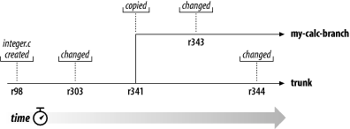

# svn branching 分支的使用

分支支持开发不同的功能却不影响代码的稳定，方法是将稳定代码置于trunk目录中，并拷贝trunk代码作为分支，修改分支添加功能后再合并进trunk目录，这样可以同时支持多个功能的独立开发。


###  典型的目录结构

```
myproject
├── branches
│   └── feature01
├── tags
│   └── release20180110-init
└── trunk
```

一个项目建立时应当初始化为这种结构，文件夹解释如下

trunk（主干）   用作存放稳定代码，不允许直接修改此文件夹代码

branches(分支) 从主干中分出来，用于某一特定目的，开发完成后合并到主干并废弃

tags(标签)          将里程碑式的代码发布拷贝进tags，便于简单的记录和了解代码历史

### 分支创建

基本等价于拷贝操作，可以在项目的branches复制一份trunk中的代码

###  分支合并

当某个分支代码已经开发完成，并且通过测试而达到了稳定的状态，则考虑将其合并到主干去。

随着时间过去，不同分支的代码会存在较大差异。合并的主要问题在于，当该分支被切出后，主干是否发生过改变，最简单的情况是主干没有发生任何改变，则直接合并即可，不会有冲突。但是若经过了改变，则有可能会有冲突存在，就需要合并冲突。



这里解决冲突的方式与其他冲突解决方式相同。